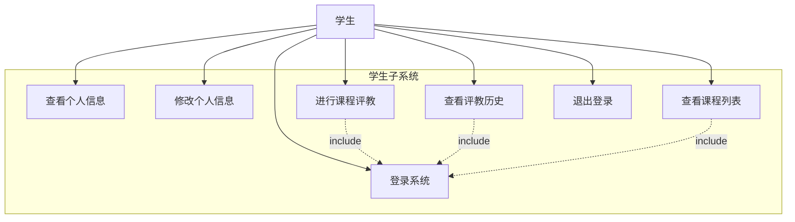
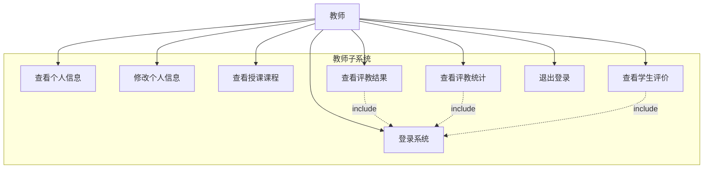
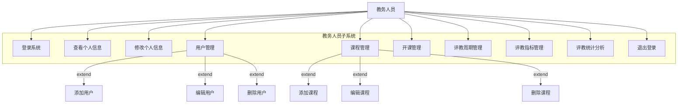

# 学生评教管理系统 - 用例图和用例规约

## 1. 系统用例图

### 1.1 总体用例图

```mermaid
graph TB
    %% 参与者
    Student[学生]
    Teacher[教师]
    Staff[教务人员]
    Admin[管理员]
    
    %% 用例
    subgraph "学生评教管理系统"
        %% 学生用例
        UC1[登录系统]
        UC2[查看个人信息]
        UC3[修改个人信息]
        UC4[查看课程列表]
        UC5[进行课程评教]
        UC6[查看评教历史]
        UC7[退出登录]
        
        %% 教师用例
        UC8[查看授课课程]
        UC9[查看评教结果]
        UC10[查看评教统计]
        UC11[查看学生评价]
        
        %% 教务人员用例
        UC12[用户管理]
        UC13[课程管理]
        UC14[开课管理]
        UC15[评教周期管理]
        UC16[评教指标管理]
        UC17[评教统计分析]
        
        %% 管理员用例
        UC18[系统用户管理]
        UC19[系统课程管理]
        UC20[系统班级管理]
        UC21[系统评教管理]
        UC22[系统统计报告]
    end
    
    %% 关联关系
    Student --> UC1
    Student --> UC2
    Student --> UC3
    Student --> UC4
    Student --> UC5
    Student --> UC6
    Student --> UC7
    
    Teacher --> UC1
    Teacher --> UC2
    Teacher --> UC3
    Teacher --> UC8
    Teacher --> UC9
    Teacher --> UC10
    Teacher --> UC11
    Teacher --> UC7
    
    Staff --> UC1
    Staff --> UC2
    Staff --> UC3
    Staff --> UC12
    Staff --> UC13
    Staff --> UC14
    Staff --> UC15
    Staff --> UC16
    Staff --> UC17
    Staff --> UC7
    
    Admin --> UC1
    Admin --> UC2
    Admin --> UC3
    Admin --> UC18
    Admin --> UC19
    Admin --> UC20
    Admin --> UC21
    Admin --> UC22
    Admin --> UC23
    Admin --> UC7
```

### 1.2 学生子系统用例图

### 1.3 教师子系统用例图

### 1.4 教务人员子系统用例图

## 2. 主要用例规约

### 2.1 UC5: 进行课程评教

**用例名称**: 进行课程评教

**参与者**: 学生

**前置条件**: 
- 学生已登录系统
- 存在进行中的评教周期
- 学生选修了相关课程
- 学生尚未对该课程进行评教

**后置条件**: 
- 评教数据保存到数据库
- 学生无法再次对同一课程进行评教

**主要流程**:
1. 学生登录系统
2. 系统显示可评教的课程列表
3. 学生选择要评教的课程
4. 系统显示评教表单，包含评教指标
5. 学生对各项指标进行评分
6. 学生填写评价意见（可选）
7. 学生提交评教
8. 系统验证评教数据
9. 系统保存评教结果
10. 系统显示评教成功信息

**异常流程**:
- 3a. 没有可评教的课程
  - 3a1. 系统显示"暂无可评教课程"
  - 3a2. 用例结束
- 8a. 评教数据验证失败
  - 8a1. 系统显示错误信息
  - 8a2. 返回步骤5
- 9a. 保存失败
  - 9a1. 系统显示"评教提交失败，请重试"
  - 9a2. 返回步骤7

### 2.2 UC13: 课程管理

**用例名称**: 课程管理

**参与者**: 教务人员

**前置条件**: 
- 教务人员已登录系统
- 具有课程管理权限

**后置条件**: 
- 课程信息更新到数据库

**主要流程**:
1. 教务人员登录系统
2. 进入课程管理模块
3. 系统显示课程列表
4. 教务人员选择操作（添加/编辑/删除课程）
5. 系统显示相应的操作界面
6. 教务人员输入/修改课程信息
7. 教务人员确认操作
8. 系统验证课程信息
9. 系统更新数据库
10. 系统显示操作成功信息

**异常流程**:
- 8a. 课程信息验证失败
  - 8a1. 系统显示具体错误信息
  - 8a2. 返回步骤6
- 9a. 数据库更新失败
  - 9a1. 系统显示"操作失败，请重试"
  - 9a2. 返回步骤7

### 2.3 UC15: 评教周期管理

**用例名称**: 评教周期管理

**参与者**: 教务人员

**前置条件**: 
- 教务人员已登录系统
- 具有评教管理权限

**后置条件**: 
- 评教周期信息更新到数据库
- 相关用户收到评教通知

**主要流程**:
1. 教务人员登录系统
2. 进入评教周期管理模块
3. 系统显示评教周期列表
4. 教务人员选择操作（创建/编辑/启动/结束周期）
5. 系统显示相应的操作界面
6. 教务人员设置周期信息（名称、时间、状态等）
7. 教务人员确认操作
8. 系统验证周期信息
9. 系统更新数据库
10. 系统发送相关通知
11. 系统显示操作成功信息

**异常流程**:
- 8a. 周期信息验证失败
  - 8a1. 系统显示具体错误信息
  - 8a2. 返回步骤6
- 9a. 数据库更新失败
  - 9a1. 系统显示"操作失败，请重试"
  - 9a2. 返回步骤7

### 2.4 UC9: 查看评教结果

**用例名称**: 查看评教结果

**参与者**: 教师

**前置条件**: 
- 教师已登录系统
- 存在已完成的评教数据

**后置条件**: 
- 无

**主要流程**:
1. 教师登录系统
2. 进入评教结果查看模块
3. 系统显示教师授课的课程列表
4. 教师选择要查看的课程
5. 系统显示该课程的评教结果统计
6. 教师可以查看详细的评分分布
7. 教师可以查看学生评价意见
8. 教师可以导出评教报告

**异常流程**:
- 3a. 没有评教数据
  - 3a1. 系统显示"暂无评教数据"
  - 3a2. 用例结束
- 8a. 导出失败
  - 8a1. 系统显示"导出失败，请重试"
  - 8a2. 返回步骤8

## 3. 用例关系说明

### 3.1 包含关系 (Include)
- 所有需要权限的用例都包含"登录系统"用例
- "查看评教统计"包含"数据分析"用例

### 3.2 扩展关系 (Extend)
- "用户管理"扩展为"添加用户"、"编辑用户"、"删除用户"
- "课程管理"扩展为"添加课程"、"编辑课程"、"删除课程"
- "评教周期管理"扩展为"创建周期"、"编辑周期"、"启动周期"、"结束周期"

### 3.3 泛化关系 (Generalization)
- "系统管理"是"用户管理"、"课程管理"、"评教管理"的泛化
- "信息查看"是"查看个人信息"、"查看课程信息"、"查看评教结果"的泛化
