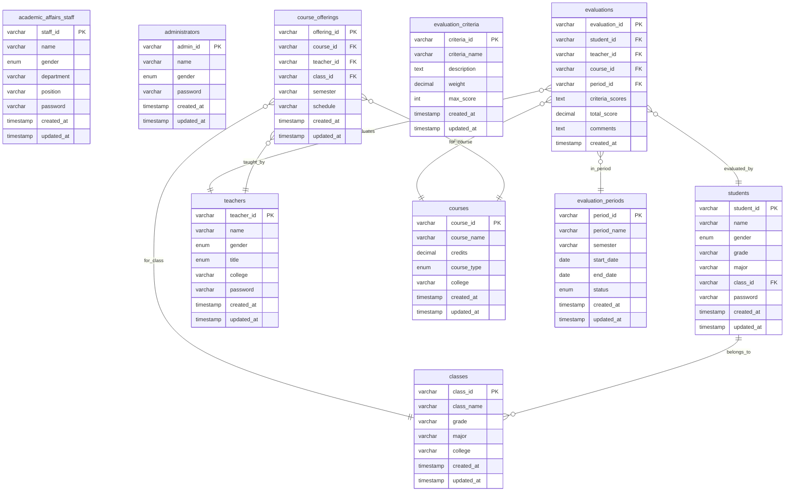

# 学生评教管理系统 - 数据库设计

## 1. 数据库概述

### 1.1 数据库设计原则
- 遵循第三范式，减少数据冗余
- 保证数据完整性和一致性
- 支持高并发访问
- 便于维护和扩展

### 1.2 数据库技术选型
- **数据库管理系统**: HSQLDB 2.7.1 (嵌入式数据库)
- **连接方式**: 直接JDBC连接
- **字符集**: UTF-8
- **存储模式**: 文件存储模式

## 2. 数据库表结构设计

### 2.1 用户相关表

#### 2.1.1 学生表 (students)
```sql
CREATE TABLE IF NOT EXISTS students (
    student_id VARCHAR(20) PRIMARY KEY,
    name VARCHAR(50) NOT NULL,
    gender VARCHAR(10),
    grade VARCHAR(10) NOT NULL,
    major VARCHAR(100) NOT NULL,
    class_id VARCHAR(20) NOT NULL,
    contact VARCHAR(50),
    password VARCHAR(100) NOT NULL,
    created_at TIMESTAMP DEFAULT CURRENT_TIMESTAMP,
    FOREIGN KEY (class_id) REFERENCES classes(class_id)
);
```

#### 2.1.2 教师表 (teachers)
```sql
CREATE TABLE IF NOT EXISTS teachers (
    teacher_id VARCHAR(20) PRIMARY KEY,
    name VARCHAR(50) NOT NULL,
    gender VARCHAR(10),
    title VARCHAR(50),
    college VARCHAR(100) NOT NULL,
    contact VARCHAR(50),
    password VARCHAR(100) NOT NULL,
    created_at TIMESTAMP DEFAULT CURRENT_TIMESTAMP
);
```

#### 2.1.3 教务人员表 (academic_affairs_staff)
```sql
CREATE TABLE IF NOT EXISTS academic_affairs_staff (
    staff_id VARCHAR(20) PRIMARY KEY,
    name VARCHAR(50) NOT NULL,
    gender VARCHAR(10),
    department VARCHAR(100) NOT NULL,
    position VARCHAR(50),
    contact VARCHAR(50),
    password VARCHAR(100) NOT NULL,
    created_at TIMESTAMP DEFAULT CURRENT_TIMESTAMP
);
```

#### 2.1.4 管理员表 (administrators)
```sql
CREATE TABLE IF NOT EXISTS administrators (
    admin_id VARCHAR(20) PRIMARY KEY,
    name VARCHAR(50) NOT NULL,
    gender VARCHAR(10),
    password VARCHAR(100) NOT NULL,
    created_at TIMESTAMP DEFAULT CURRENT_TIMESTAMP
);
```

### 2.2 课程相关表

#### 2.2.1 课程表 (courses)
```sql
CREATE TABLE IF NOT EXISTS courses (
    course_id VARCHAR(20) PRIMARY KEY,
    course_name VARCHAR(100) NOT NULL,
    credits DECIMAL(3,1) NOT NULL,
    course_type VARCHAR(20) NOT NULL,
    college VARCHAR(100) NOT NULL,
    created_at TIMESTAMP DEFAULT CURRENT_TIMESTAMP
);
```

#### 2.2.2 班级表 (classes)
```sql
CREATE TABLE IF NOT EXISTS classes (
    class_id VARCHAR(20) PRIMARY KEY,
    class_name VARCHAR(100) NOT NULL,
    grade VARCHAR(10) NOT NULL,
    major VARCHAR(100) NOT NULL,
    college VARCHAR(100) NOT NULL,
    student_count INTEGER DEFAULT 0,
    created_at TIMESTAMP DEFAULT CURRENT_TIMESTAMP
);
```

#### 2.2.3 开课表 (course_offerings)
```sql
CREATE TABLE IF NOT EXISTS course_offerings (
    offering_id VARCHAR(20) PRIMARY KEY,
    course_id VARCHAR(20) NOT NULL,
    teacher_id VARCHAR(20) NOT NULL,
    class_id VARCHAR(20) NOT NULL,
    semester VARCHAR(20) NOT NULL,
    schedule VARCHAR(200),
    created_at TIMESTAMP DEFAULT CURRENT_TIMESTAMP,
    FOREIGN KEY (course_id) REFERENCES courses(course_id),
    FOREIGN KEY (teacher_id) REFERENCES teachers(teacher_id),
    FOREIGN KEY (class_id) REFERENCES classes(class_id)
);
```

### 2.3 评教相关表

#### 2.3.1 评教周期表 (evaluation_periods)
```sql
CREATE TABLE IF NOT EXISTS evaluation_periods (
    period_id VARCHAR(20) PRIMARY KEY,
    period_name VARCHAR(100) NOT NULL,
    semester VARCHAR(20) NOT NULL,
    start_date DATE NOT NULL,
    end_date DATE NOT NULL,
    status VARCHAR(20) NOT NULL DEFAULT '未开始',
    created_at TIMESTAMP DEFAULT CURRENT_TIMESTAMP
);
```

#### 2.3.2 评教指标表 (evaluation_criteria)
```sql
CREATE TABLE IF NOT EXISTS evaluation_criteria (
    criteria_id VARCHAR(20) PRIMARY KEY,
    criteria_name VARCHAR(100) NOT NULL,
    description CLOB,
    weight DECIMAL(5,2) NOT NULL,
    max_score INTEGER NOT NULL DEFAULT 100,
    created_at TIMESTAMP DEFAULT CURRENT_TIMESTAMP
);
```

#### 2.3.3 评教记录表 (evaluations)
```sql
CREATE TABLE IF NOT EXISTS evaluations (
    evaluation_id VARCHAR(20) PRIMARY KEY,
    student_id VARCHAR(20) NOT NULL,
    teacher_id VARCHAR(20) NOT NULL,
    course_id VARCHAR(20) NOT NULL,
    period_id VARCHAR(20) NOT NULL,
    criteria_scores CLOB,
    total_score DECIMAL(5,2) NOT NULL,
    comments CLOB,
    created_at TIMESTAMP DEFAULT CURRENT_TIMESTAMP,
    FOREIGN KEY (student_id) REFERENCES students(student_id),
    FOREIGN KEY (teacher_id) REFERENCES teachers(teacher_id),
    FOREIGN KEY (course_id) REFERENCES courses(course_id),
    FOREIGN KEY (period_id) REFERENCES evaluation_periods(period_id)
);
```

## 3. 数据库关系图



## 4. 索引设计

### 4.1 主键索引
- 所有表都有主键索引，保证数据唯一性

### 4.2 外键索引
- course_offerings表的外键字段建立索引
- evaluations表的外键字段建立索引

### 4.3 业务索引
- 按班级查询学生：idx_class_id
- 按年级专业查询：idx_grade_major
- 按学院查询：idx_college
- 按评教周期查询：idx_period_id
- 按总分排序：idx_total_score

## 5. 数据完整性约束

### 5.1 实体完整性
- 所有表都有主键约束
- 主键字段不允许为空

### 5.2 参照完整性
- 外键约束保证数据一致性
- 级联删除避免孤立数据

### 5.3 域完整性
- 性别字段使用枚举类型
- 职称字段使用枚举类型
- 课程类型字段使用枚举类型
- 评教状态字段使用枚举类型

### 5.4 用户定义完整性
- 学分必须大于0
- 权重必须在0-100之间
- 评分必须在0-最高分之间
- 开始日期必须小于结束日期

## 6. 数据库初始化脚本

### 6.1 创建数据库
```sql
-- HSQLDB使用文件数据库，无需CREATE DATABASE语句
-- 数据库文件位置：./data/student_evaluation_db
-- 连接URL：jdbc:hsqldb:file:./data/student_evaluation_db
```

### 6.2 插入初始数据

#### 6.2.1 管理员数据
```sql
INSERT INTO administrators (admin_id, name, gender, password) VALUES
('admin001', '系统管理员', '男', 'admin123');
```

#### 6.2.2 评教指标数据
```sql
INSERT INTO evaluation_criteria (criteria_id, criteria_name, description, weight, max_score) VALUES
('C001', '教学态度', '教师的教学态度和责任心', 20.0, 100),
('C002', '教学内容', '教学内容的丰富性和实用性', 25.0, 100),
('C003', '教学方法', '教学方法的多样性和有效性', 20.0, 100),
('C004', '课堂管理', '课堂纪律和时间管理', 15.0, 100),
('C005', '师生互动', '与学生的交流和互动情况', 20.0, 100);
```

#### 6.2.3 示例班级数据
```sql
INSERT INTO classes (class_id, class_name, grade, major, college, student_count) VALUES
('软件工程2301', '软件工程2301班', '23', '软件工程', '信息科学与工程学院', 0),
('软件工程2302', '软件工程2302班', '23', '软件工程', '信息科学与工程学院', 0),
('计算机2301', '计算机科学与技术2301班', '23', '计算机科学与技术', '信息科学与工程学院', 0);
```

## 7. 数据库维护

### 7.1 备份策略
- 每日增量备份
- 每周全量备份
- 重要操作前手动备份

### 7.2 性能优化
- 定期分析表结构
- 优化慢查询
- 监控索引使用情况

### 7.3 安全措施
- 定期更新密码
- 限制数据库访问权限
- 启用审计日志
