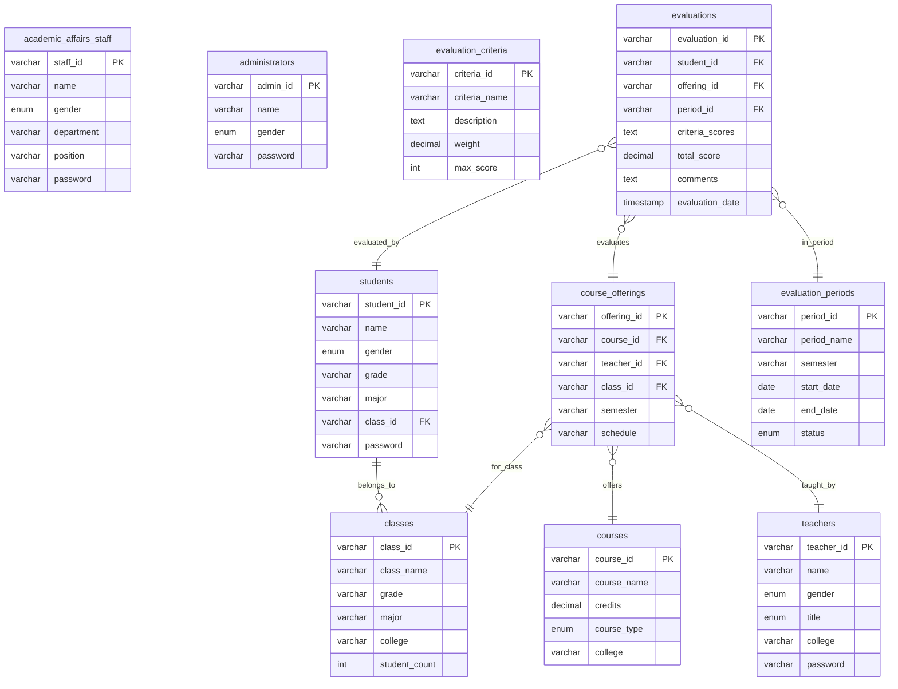

# 学生评教管理系统 - 数据库设计

## 1. 数据库概述

### 1.1 数据库设计原则
- 遵循第三范式，减少数据冗余
- 保证数据完整性和一致性
- 支持高并发访问
- 便于维护和扩展

### 1.2 数据库技术选型
- **数据库管理系统**: HSQLDB 2.7.1 (嵌入式数据库)
- **连接方式**: 直接JDBC连接
- **字符集**: UTF-8
- **存储模式**: 文件存储模式

## 2. 数据库表结构设计

### 2.1 用户相关表

#### 2.1.1 学生表 (students)
```sql
CREATE TABLE IF NOT EXISTS students (
    student_id VARCHAR(20) PRIMARY KEY,
    name VARCHAR(50) NOT NULL,
    gender VARCHAR(10),
    grade VARCHAR(10) NOT NULL,
    major VARCHAR(100) NOT NULL,
    class_id VARCHAR(20) NOT NULL,
    password VARCHAR(100) NOT NULL,
    FOREIGN KEY (class_id) REFERENCES classes(class_id)
);
```

**字段说明：**
- `student_id`: 学生学号，格式如 231210400111
- `name`: 学生姓名
- `gender`: 性别（男/女）
- `grade`: 年级，格式如 23（表示2023级）
- `major`: 专业名称
- `class_id`: 班级编号，外键关联classes表，格式如 SE2301
- `password`: 登录密码

#### 2.1.2 教师表 (teachers)
```sql
CREATE TABLE IF NOT EXISTS teachers (
    teacher_id VARCHAR(20) PRIMARY KEY,
    name VARCHAR(50) NOT NULL,
    gender VARCHAR(10),
    title VARCHAR(50),
    college VARCHAR(100) NOT NULL,
    password VARCHAR(100) NOT NULL
);
```

**字段说明：**
- `teacher_id`: 教师工号，格式如 T20240001
- `name`: 教师姓名
- `gender`: 性别（男/女）
- `title`: 职称（教授/副教授/讲师/助教）
- `college`: 所属学院
- `password`: 登录密码

#### 2.1.3 教务人员表 (academic_affairs_staff)
```sql
CREATE TABLE IF NOT EXISTS academic_affairs_staff (
    staff_id VARCHAR(20) PRIMARY KEY,
    name VARCHAR(50) NOT NULL,
    gender VARCHAR(10),
    department VARCHAR(100) NOT NULL,
    position VARCHAR(50),
    password VARCHAR(100) NOT NULL
);
```

**字段说明：**
- `staff_id`: 教务人员工号，格式如 S20240001
- `name`: 教务人员姓名
- `gender`: 性别（男/女）
- `department`: 所属部门（目前仅支持教务处）
- `position`: 职位（主任/副主任/教务员）
- `password`: 登录密码

#### 2.1.4 管理员表 (administrators)
```sql
CREATE TABLE IF NOT EXISTS administrators (
    admin_id VARCHAR(20) PRIMARY KEY,
    name VARCHAR(50) NOT NULL,
    gender VARCHAR(10),
    password VARCHAR(100) NOT NULL
);
```

**字段说明：**
- `admin_id`: 管理员账号，格式如 ADMIN001
- `name`: 管理员姓名
- `gender`: 性别（男/女）
- `password`: 登录密码

### 2.2 课程相关表

#### 2.2.1 课程表 (courses)
```sql
CREATE TABLE IF NOT EXISTS courses (
    course_id VARCHAR(20) PRIMARY KEY,
    course_name VARCHAR(100) NOT NULL,
    credits DECIMAL(3,1) NOT NULL,
    course_type VARCHAR(20) NOT NULL,
    college VARCHAR(100) NOT NULL
);
```

**字段说明：**
- `course_id`: 课程编号，格式如 AI0001、IS0001
- `course_name`: 课程名称
- `credits`: 学分，支持一位小数
- `course_type`: 课程类型（必修/选修）
- `college`: 开课学院

#### 2.2.2 班级表 (classes)
```sql
CREATE TABLE IF NOT EXISTS classes (
    class_id VARCHAR(20) PRIMARY KEY,
    class_name VARCHAR(100) NOT NULL,
    grade VARCHAR(10) NOT NULL,
    major VARCHAR(100) NOT NULL,
    college VARCHAR(100) NOT NULL,
    student_count INTEGER DEFAULT 0
);
```

**字段说明：**
- `class_id`: 班级编号，使用英文缩写格式，如 SE2301（软件工程2301）、CS2301（计算机2301）
- `class_name`: 班级名称，如"软件工程2301班"
- `grade`: 年级，格式如 23（表示2023级）
- `major`: 专业名称
- `college`: 所属学院
- `student_count`: 班级学生数量

**班级编号规则：**
- 软件工程：SE + 年级 + 班级序号，如 SE2301、SE2302
- 计算机科学与技术：CS + 年级 + 班级序号，如 CS2301、CS2302
- 数据科学与大数据技术：DS + 年级 + 班级序号，如 DS2301
- 人工智能：AI + 年级 + 班级序号，如 AI2301
- 网络工程：NE + 年级 + 班级序号，如 NE2301
- 信息安全：IS + 年级 + 班级序号，如 IS2301

#### 2.2.3 开课表 (course_offerings)
```sql
CREATE TABLE IF NOT EXISTS course_offerings (
    offering_id VARCHAR(20) PRIMARY KEY,
    course_id VARCHAR(20) NOT NULL,
    teacher_id VARCHAR(20) NOT NULL,
    class_id VARCHAR(20) NOT NULL,
    semester VARCHAR(20) NOT NULL,
    schedule VARCHAR(200),
    FOREIGN KEY (course_id) REFERENCES courses(course_id),
    FOREIGN KEY (teacher_id) REFERENCES teachers(teacher_id),
    FOREIGN KEY (class_id) REFERENCES classes(class_id)
);
```

**字段说明：**
- `offering_id`: 开课编号，格式如 OFF001
- `course_id`: 课程编号，外键关联courses表
- `teacher_id`: 授课教师工号，外键关联teachers表
- `class_id`: 授课班级编号，外键关联classes表
- `semester`: 学期，格式如 2025-1（2025年第1学期）
- `schedule`: 上课时间安排，如"周一 1-2节"

### 2.3 评教相关表

#### 2.3.1 评教周期表 (evaluation_periods)
```sql
CREATE TABLE IF NOT EXISTS evaluation_periods (
    period_id VARCHAR(20) PRIMARY KEY,
    period_name VARCHAR(100) NOT NULL,
    semester VARCHAR(20) NOT NULL,
    start_date DATE NOT NULL,
    end_date DATE NOT NULL,
    status VARCHAR(20) NOT NULL DEFAULT '未开始'
);
```

**字段说明：**
- `period_id`: 评教周期编号，格式如 EP2025001
- `period_name`: 评教周期名称，如"2025年春季学期期中评教"
- `semester`: 学期，格式如 2025-1
- `start_date`: 评教开始日期
- `end_date`: 评教结束日期
- `status`: 评教状态（未开始/进行中/已结束）

**注意：** 评教周期不支持删除操作，学生只能在状态为"进行中"的评教周期内进行评教。

#### 2.3.2 评教指标表 (evaluation_criteria)
```sql
CREATE TABLE IF NOT EXISTS evaluation_criteria (
    criteria_id VARCHAR(20) PRIMARY KEY,
    criteria_name VARCHAR(100) NOT NULL,
    description CLOB,
    weight DECIMAL(5,2) NOT NULL,
    max_score INTEGER NOT NULL DEFAULT 100
);
```

**字段说明：**
- `criteria_id`: 评教指标编号，格式如 EC001
- `criteria_name`: 评教指标名称，如"教学内容充实，重点突出"
- `description`: 指标描述（可选）
- `weight`: 权重，支持两位小数
- `max_score`: 最高分数，默认为100分

#### 2.3.3 评教记录表 (evaluations)
```sql
CREATE TABLE IF NOT EXISTS evaluations (
    evaluation_id VARCHAR(20) PRIMARY KEY,
    student_id VARCHAR(20) NOT NULL,
    offering_id VARCHAR(20) NOT NULL,
    period_id VARCHAR(20) NOT NULL,
    criteria_scores CLOB NOT NULL,
    total_score DECIMAL(5,2),
    comments CLOB,
    evaluation_date TIMESTAMP DEFAULT CURRENT_TIMESTAMP,
    FOREIGN KEY (student_id) REFERENCES students(student_id),
    FOREIGN KEY (offering_id) REFERENCES course_offerings(offering_id),
    FOREIGN KEY (period_id) REFERENCES evaluation_periods(period_id),
    UNIQUE(student_id, offering_id, period_id)
);
```

**字段说明：**
- `evaluation_id`: 评教记录编号，格式如 E001
- `student_id`: 评教学生学号，外键关联students表
- `offering_id`: 开课编号，外键关联course_offerings表（替代原来的teacher_id和course_id）
- `period_id`: 评教周期编号，外键关联evaluation_periods表
- `criteria_scores`: 各项指标得分，JSON格式存储，如 {"C001":85,"C002":90}
- `total_score`: 总分，根据各项指标得分和权重计算
- `comments`: 评价意见（可选）
- `evaluation_date`: 评教时间

**重要约束：**
- 每个学生在同一评教周期内对同一开课只能评教一次（UNIQUE约束）
- 评教记录一旦提交不可修改

## 3. 数据库关系图



## 4. 索引设计

### 4.1 主键索引
- 所有表都有主键索引，保证数据唯一性

### 4.2 外键索引
- course_offerings表的外键字段建立索引
- evaluations表的外键字段建立索引

### 4.3 业务索引
- 按班级查询学生：idx_class_id
- 按年级专业查询：idx_grade_major
- 按学院查询：idx_college
- 按评教周期查询：idx_period_id
- 按总分排序：idx_total_score

## 5. 数据完整性约束

### 5.1 实体完整性
- 所有表都有主键约束
- 主键字段不允许为空

### 5.2 参照完整性
- 外键约束保证数据一致性
- 级联删除避免孤立数据

### 5.3 域完整性
- 性别字段使用枚举类型
- 职称字段使用枚举类型
- 课程类型字段使用枚举类型
- 评教状态字段使用枚举类型

### 5.4 用户定义完整性
- 学分必须大于0
- 权重必须在0-100之间
- 评分必须在0-最高分之间
- 开始日期必须小于结束日期

## 6. 数据库初始化脚本

### 6.1 创建数据库
```sql
-- HSQLDB使用文件数据库，无需CREATE DATABASE语句
-- 数据库文件位置：./data/student_evaluation_db
-- 连接URL：jdbc:hsqldb:file:./data/student_evaluation_db
```

### 6.2 插入初始数据

#### 6.2.1 管理员数据
```sql
INSERT INTO administrators (admin_id, name, gender, password) VALUES
('ADMIN001', '系统管理员', '男', '123456');
```

#### 6.2.2 评教指标数据
```sql
INSERT INTO evaluation_criteria (criteria_id, criteria_name, description, weight, max_score) VALUES
('C001', '教学态度', '教师的教学态度和责任心', 20.0, 100),
('C002', '教学内容', '教学内容的丰富性和实用性', 25.0, 100),
('C003', '教学方法', '教学方法的多样性和有效性', 20.0, 100),
('C004', '课堂管理', '课堂纪律和时间管理', 15.0, 100),
('C005', '师生互动', '与学生的交流和互动情况', 20.0, 100);
```

#### 6.2.3 示例班级数据
```sql
INSERT INTO classes (class_id, class_name, grade, major, college, student_count) VALUES
('SE2301', '软件工程2301班', '23', '软件工程', '人工智能与大数据学院', 0),
('SE2302', '软件工程2302班', '23', '软件工程', '人工智能与大数据学院', 0),
('CS2301', '计算机科学与技术2301班', '23', '计算机科学与技术', '信息科学与工程学院', 0),
('CS2302', '计算机科学与技术2302班', '23', '计算机科学与技术', '信息科学与工程学院', 0),
('DS2301', '数据科学与大数据技术2301班', '23', '数据科学与大数据技术', '人工智能与大数据学院', 0);
```

#### 6.2.4 示例学生数据
```sql
INSERT INTO students (student_id, name, gender, grade, major, class_id, password) VALUES
('231210400111', '张三', '男', '23', '软件工程', 'SE2301', '123456'),
('231210400112', '李四', '女', '23', '软件工程', 'SE2301', '123456'),
('231210400113', '王五', '男', '23', '软件工程', 'SE2301', '123456'),
('231210400121', '赵六', '女', '23', '软件工程', 'SE2302', '123456'),
('231210400122', '钱七', '男', '23', '软件工程', 'SE2302', '123456'),
('231210500111', '孙八', '女', '23', '计算机科学与技术', 'CS2301', '123456'),
('231210500112', '周九', '男', '23', '计算机科学与技术', 'CS2301', '123456'),
('231210500121', '吴十', '女', '23', '计算机科学与技术', 'CS2302', '123456'),
('231210600111', '郑一', '男', '23', '数据科学与大数据技术', 'DS2301', '123456'),
('231210600112', '王二', '女', '23', '数据科学与大数据技术', 'DS2301', '123456');
```

#### 6.2.5 示例教师数据
```sql
INSERT INTO teachers (teacher_id, name, gender, title, college, password) VALUES
('T20240001', '陈教授', '男', '教授', '人工智能与大数据学院', '123456'),
('T20240002', '刘副教授', '女', '副教授', '人工智能与大数据学院', '123456'),
('T20240003', '张讲师', '男', '讲师', '信息科学与工程学院', '123456'),
('T20240004', '李助教', '女', '助教', '信息科学与工程学院', '123456'),
('T20240005', '王教授', '男', '教授', '信息科学与工程学院', '123456'),
('T20240006', '赵副教授', '女', '副教授', '人工智能与大数据学院', '123456');
```

#### 6.2.6 示例教务人员数据
```sql
INSERT INTO academic_affairs_staff (staff_id, name, gender, department, position, password) VALUES
('S20240001', '教务主任', '男', '教务处', '主任', '123456'),
('S20240002', '教务副主任', '女', '教务处', '副主任', '123456'),
('S20240003', '教务员', '女', '教务处', '教务员', '123456');
```

## 7. 系统特殊设计说明

### 7.1 数据格式规范

#### 7.1.1 用户ID格式
- **学生学号**: 12位数字，格式为 YYYYLLCCCCNN
  - YYYY: 入学年份（如2023年入学为23）
  - LL: 学院代码（12表示人工智能与大数据学院，10表示信息科学与工程学院）
  - CCCC: 专业代码（0400表示软件工程，0500表示计算机科学与技术，0600表示数据科学与大数据技术）
  - NN: 学生序号（01-99）
  - 示例：231210400111（2023级人工智能与大数据学院软件工程专业第11号学生）

- **教师工号**: 格式为 T + 8位数字
  - 示例：T20240001

- **教务人员工号**: 格式为 S + 8位数字
  - 示例：S20240001

- **管理员账号**: 格式为 ADMIN + 3位数字
  - 示例：ADMIN001

#### 7.1.2 班级编号格式
- 使用英文缩写 + 年级 + 班级序号
- 软件工程：SE + 年级 + 序号（如SE2301）
- 计算机科学与技术：CS + 年级 + 序号（如CS2301）
- 数据科学与大数据技术：DS + 年级 + 序号（如DS2301）

#### 7.1.3 课程编号格式
- 学院代码 + 4位序号
- AI开头：人工智能与大数据学院课程（如AI0001）
- IS开头：信息科学与工程学院课程（如IS0001）

### 7.2 业务规则

#### 7.2.1 评教规则
- 每个学生在同一评教周期内对同一开课只能评教一次
- 学生只能在状态为"进行中"的评教周期内进行评教
- 评教记录一旦提交不可修改
- 评教周期不支持删除操作

#### 7.2.2 用户界面规则
- **评教结果查询面板**：纯表格显示，无查询条件，自动加载所有评教数据
- **统计分析面板**：支持按评教周期和统计类型进行查询
- **课程管理**：不支持课程删除操作
- **班级管理**：不支持班级编辑，但支持删除；学生班级调整通过用户管理面板进行
- **评教管理**：评教周期不可删除

#### 7.2.3 数据完整性
- 移除了所有联系方式（contact）字段
- 移除了所有created_at时间戳字段（除evaluations表的evaluation_date）
- 简化了数据结构，专注于核心评教功能

### 7.3 系统架构特点

#### 7.3.1 数据库连接
- 使用HSQLDB嵌入式数据库
- 文件存储模式，数据文件位于./data/目录
- 直接JDBC连接，无需额外数据库服务器

#### 7.3.2 服务层设计
- 采用MVS（Model-View-Service）架构模式
- 所有业务逻辑集中在Service层
- DAO层负责数据访问，位于dao文件夹
- 无单独的SQL执行器或事务管理器类

#### 7.3.3 UI设计原则
- 混合交互模式：部分面板只读，部分面板可交互
- 操作列使用可点击按钮打开对应对话框
- 文本输入优于下拉选择（如班级选择）
- 简洁美观的界面布局

## 8. 数据库维护

### 8.1 备份策略
- 每日增量备份
- 每周全量备份
- 重要操作前手动备份

### 8.2 性能优化
- 定期分析表结构
- 优化慢查询
- 监控索引使用情况

### 8.3 安全措施
- 定期更新密码
- 限制数据库访问权限
- 启用审计日志

## 9. 总结

本数据库设计文档基于实际运行的学生评教管理系统代码编写，确保了文档与实现的一致性。主要特点包括：

### 9.1 设计亮点
- **简洁高效**：移除了不必要的字段和功能，专注于核心评教业务
- **数据规范**：统一的ID格式和命名规范，便于维护和扩展
- **完整性保证**：通过外键约束和唯一约束确保数据一致性
- **用户友好**：界面设计考虑了实际使用场景，提供了良好的用户体验

### 9.2 技术特色
- **嵌入式数据库**：使用HSQLDB，无需额外数据库服务器，部署简单
- **MVS架构**：清晰的分层架构，便于维护和测试
- **JSON存储**：评教分数使用JSON格式存储，灵活支持多种评教指标

### 9.3 业务价值
- **真实场景**：基于实际需求设计，符合高校评教管理实际情况
- **可扩展性**：预留了扩展空间，可根据需要添加新功能
- **易维护性**：代码结构清晰，文档完整，便于后续维护和升级

本设计为学生评教管理提供了完整、可靠的数据存储解决方案，支持系统的稳定运行和未来发展。
