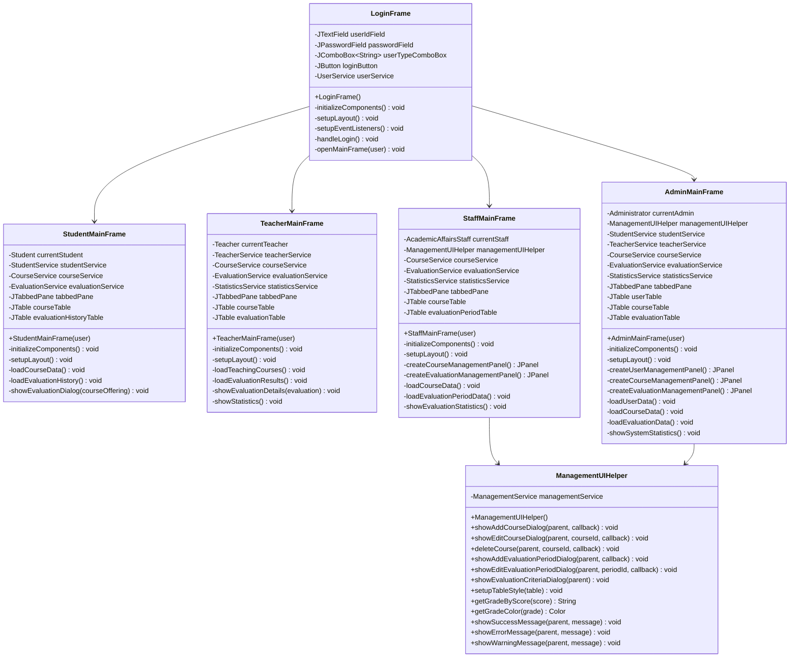

# 学生评教管理系统 - 类设计

## 1. 系统架构概述

### 1.1 架构模式
本系统采用**MVS (Model-View-Service)** 三层架构模式：
- **Model层**: 数据模型和实体类
- **View层**: 用户界面和交互逻辑
- **Service层**: 业务逻辑和数据访问

### 1.2 包结构
```
edu.ai.haut
├── model/          # 数据模型层
├── service/        # 业务服务层
├── ui/            # 用户界面层
│   ├── admin/     # 管理员界面
│   ├── staff/     # 教务人员界面
│   ├── teacher/   # 教师界面
│   ├── student/   # 学生界面
│   └── common/    # 通用UI组件
├── util/          # 工具类
└── Main.java      # 主程序入口
```

## 2. 核心类设计

### 2.1 Model层类图

```mermaid
classDiagram
    class User {
        <<abstract>>
        -String userId
        -String name
        -String gender
        -String password
        -LocalDateTime createdAt
        +User(userId, name, gender, password)
        +getUserId() String
        +getName() String
        +getGender() String
        +setPassword(password) void
        +validatePassword(password) boolean
    }
    
    class Student {
        -String studentId
        -String grade
        -String major
        -String classId
        +Student(studentId, name, gender, grade, major, classId, password)
        +getGrade() String
        +getMajor() String
        +getClassId() String
        +setClassId(classId) void
    }
    
    class Teacher {
        -String teacherId
        -String title
        -String college
        +Teacher(teacherId, name, gender, title, college, password)
        +getTitle() String
        +getCollege() String
        +setTitle(title) void
        +setCollege(college) void
    }
    
    class AcademicAffairsStaff {
        -String staffId
        -String department
        -String position
        +AcademicAffairsStaff(staffId, name, gender, department, position, password)
        +getDepartment() String
        +getPosition() String
        +setPosition(position) void
    }
    
    class Administrator {
        -String adminId
        +Administrator(adminId, name, gender, password)
        +getAdminId() String
    }
    
    class Course {
        -String courseId
        -String courseName
        -double credits
        -String courseType
        -String college
        -LocalDateTime createdAt
        +Course(courseId, courseName, credits, courseType, college)
        +getCourseId() String
        +getCourseName() String
        +getCredits() double
        +getCourseType() String
        +getCollege() String
    }
    
    class ClassRoom {
        -String classId
        -String className
        -String grade
        -String major
        -String college
        -LocalDateTime createdAt
        +ClassRoom()
        +getClassId() String
        +getClassName() String
        +getGrade() String
        +getMajor() String
        +getCollege() String
    }
    
    class CourseOffering {
        -String offeringId
        -String courseId
        -String teacherId
        -String classId
        -String semester
        -String schedule
        -LocalDateTime createdAt
        +CourseOffering(offeringId, courseId, teacherId, classId, semester, schedule)
        +getOfferingId() String
        +getCourseId() String
        +getTeacherId() String
        +getClassId() String
        +getSemester() String
        +getSchedule() String
    }
    
    class EvaluationPeriod {
        -String periodId
        -String periodName
        -String semester
        -LocalDate startDate
        -LocalDate endDate
        -String status
        -LocalDateTime createdAt
        +EvaluationPeriod(periodId, periodName, semester, startDate, endDate)
        +getPeriodId() String
        +getPeriodName() String
        +getSemester() String
        +getStartDate() LocalDate
        +getEndDate() LocalDate
        +getStatus() String
        +setStatus(status) void
        +isActive() boolean
    }
    
    class EvaluationCriteria {
        -String criteriaId
        -String criteriaName
        -String description
        -double weight
        -int maxScore
        -LocalDateTime createdAt
        +EvaluationCriteria(criteriaId, criteriaName, description, weight, maxScore)
        +getCriteriaId() String
        +getCriteriaName() String
        +getDescription() String
        +getWeight() double
        +getMaxScore() int
    }
    
    class Evaluation {
        -String evaluationId
        -String studentId
        -String teacherId
        -String courseId
        -String periodId
        -String criteriaScores
        -double totalScore
        -String comments
        -LocalDateTime createdAt
        +Evaluation(evaluationId, studentId, teacherId, courseId, periodId)
        +getEvaluationId() String
        +getStudentId() String
        +getTeacherId() String
        +getCourseId() String
        +getPeriodId() String
        +getCriteriaScores() String
        +getTotalScore() double
        +getComments() String
        +setCriteriaScores(scores) void
        +setTotalScore(score) void
        +setComments(comments) void
    }
    
    User <|-- Student
    User <|-- Teacher
    User <|-- AcademicAffairsStaff
    User <|-- Administrator
    
    Student "n" --> "1" ClassRoom : belongs to
    CourseOffering "n" --> "1" Course : offers
    CourseOffering "n" --> "1" Teacher : taught by
    CourseOffering "n" --> "1" ClassRoom : for class
    Evaluation "n" --> "1" Student : evaluated by
    Evaluation "n" --> "1" Teacher : evaluates
    Evaluation "n" --> "1" Course : for course
    Evaluation "n" --> "1" EvaluationPeriod : in period
```



### 2.2 Service层类图

```mermaid
classDiagram
    class UserService {
        -Connection connection
        +UserService()
        +authenticateUser(userId, password) User
        +getUserById(userId) User
        +updateUserPassword(userId, newPassword) boolean
        +getAllUsers() List~User~
        -hashPassword(password) String
        -verifyPassword(password, hash) boolean
    }
    
    class StudentService {
        -Connection connection
        +StudentService()
        +registerStudent(student) boolean
        +getStudentById(studentId) Student
        +updateStudent(student) boolean
        +deleteStudent(studentId) boolean
        +getAllStudents() List~Student~
        +getStudentsByClass(classId) List~Student~
        +getStudentCountByClass(classId) int
    }
    
    class TeacherService {
        -Connection connection
        +TeacherService()
        +registerTeacher(teacher) boolean
        +getTeacherById(teacherId) Teacher
        +updateTeacher(teacher) boolean
        +deleteTeacher(teacherId) boolean
        +getAllTeachers() List~Teacher~
        +getTeachersByCollege(college) List~Teacher~
    }
    
    class CourseService {
        -Connection connection
        +CourseService()
        +createCourse(course) boolean
        +getCourseById(courseId) Course
        +updateCourse(course) boolean
        +deleteCourse(courseId) boolean
        +getAllCourses() List~Course~
        +getCoursesByType(type) List~Course~
        +createCourseOffering(offering) boolean
        +updateCourseOffering(offering) boolean
        +deleteCourseOffering(offeringId) boolean
        +getAllCourseOfferings() List~CourseOffering~
        +getCourseOfferingsByTeacher(teacherId) List~CourseOffering~
        +getCourseOfferingsByStudent(studentId) List~CourseOffering~
    }
    
    class EvaluationService {
        -Connection connection
        +EvaluationService()
        +createEvaluationPeriod(period) boolean
        +updateEvaluationPeriod(period) boolean
        +getAllEvaluationPeriods() List~EvaluationPeriod~
        +getActiveEvaluationPeriod() EvaluationPeriod
        +createEvaluationCriteria(criteria) boolean
        +updateEvaluationCriteria(criteria) boolean
        +deleteEvaluationCriteria(criteriaId) boolean
        +getAllEvaluationCriteria() List~EvaluationCriteria~
        +submitEvaluation(evaluation) boolean
        +getEvaluationsByStudent(studentId) List~Evaluation~
        +getEvaluationsByTeacher(teacherId) List~Evaluation~
        +hasStudentEvaluated(studentId, teacherId, courseId, periodId) boolean
    }
    
    class StatisticsService {
        -Connection connection
        +StatisticsService()
        +getTeacherEvaluationStatistics(teacherId, periodId) Map~String,Object~
        +getCourseEvaluationStatistics(courseId, periodId) Map~String,Object~
        +getClassEvaluationStatistics(classId, periodId) Map~String,Object~
        +getOverallEvaluationStatistics(periodId) Map~String,Object~
        +generateEvaluationReport(periodId) String
        +getEvaluationTrends(teacherId, periods) List~Map~String,Object~~
    }
    
    class ClassService {
        -Connection connection
        +ClassService()
        +createClass(classRoom) boolean
        +getClassById(classId) ClassRoom
        +updateClass(classRoom) boolean
        +deleteClass(classId) boolean
        +getAllClasses() List~ClassRoom~
        +getClassByName(className) ClassRoom
        +getClassesByGrade(grade) List~ClassRoom~
    }
    
    class AcademicAffairsStaffService {
        -Connection connection
        +AcademicAffairsStaffService()
        +registerStaff(staff) boolean
        +getStaffById(staffId) AcademicAffairsStaff
        +updateStaff(staff) boolean
        +deleteStaff(staffId) boolean
        +getAllStaff() List~AcademicAffairsStaff~
    }
    
    class ManagementService {
        -CourseService courseService
        -EvaluationService evaluationService
        -ClassService classService
        -StatisticsService statisticsService
        +ManagementService()
        +createCourse(course) boolean
        +updateCourse(course) boolean
        +deleteCourse(courseId) boolean
        +getAllCourses() List~Course~
        +getCourseById(courseId) Course
        +createEvaluationPeriod(period) boolean
        +updateEvaluationPeriod(period) boolean
        +getAllEvaluationPeriods() List~EvaluationPeriod~
        +createEvaluationCriteria(criteria) boolean
        +updateEvaluationCriteria(criteria) boolean
        +deleteEvaluationCriteria(criteriaId) boolean
        +getAllEvaluationCriteria() List~EvaluationCriteria~
        +validateCourseData(course) boolean
        +validateEvaluationPeriodData(period) boolean
        +validateEvaluationCriteriaData(criteria) boolean
    }
    
    ManagementService --> CourseService
    ManagementService --> EvaluationService
    ManagementService --> ClassService
    ManagementService --> StatisticsService
```



### 2.3 UI层类图



## 3. 设计模式应用

### 3.1 单例模式 (Singleton)
- **DatabaseUtil**: 数据库连接管理
- **应用场景**: 确保全局只有一个数据库连接池实例

### 3.2 工厂模式 (Factory)
- **UserFactory**: 根据用户类型创建不同的用户对象
- **应用场景**: 登录时根据用户类型创建相应的用户实例

### 3.3 观察者模式 (Observer)
- **EvaluationObserver**: 评教状态变化通知
- **应用场景**: 评教周期状态改变时通知相关用户

### 3.4 策略模式 (Strategy)
- **GradingStrategy**: 不同的评分等级计算策略
- **应用场景**: 根据不同的评分标准计算等级

### 3.5 模板方法模式 (Template Method)
- **BaseMainFrame**: 主界面的通用模板
- **应用场景**: 不同角色的主界面有相同的基本结构

## 4. 关键接口设计

### 4.1 数据访问接口
```java
public interface BaseDAO<T> {
    boolean create(T entity);
    T getById(String id);
    boolean update(T entity);
    boolean delete(String id);
    List<T> getAll();
}
```

### 4.2 业务服务接口
```java
public interface EvaluationServiceInterface {
    boolean submitEvaluation(Evaluation evaluation);
    List<Evaluation> getEvaluationsByStudent(String studentId);
    List<Evaluation> getEvaluationsByTeacher(String teacherId);
    boolean hasStudentEvaluated(String studentId, String teacherId, String courseId, String periodId);
}
```

### 4.3 UI回调接口
```java
public interface DataRefreshCallback {
    void onDataRefresh();
}
```

## 5. 类的职责说明

### 5.1 Model层职责
- **User及其子类**: 封装用户基本信息和行为
- **Course**: 封装课程信息和相关操作
- **Evaluation**: 封装评教记录和评分逻辑
- **EvaluationPeriod**: 管理评教周期状态
- **EvaluationCriteria**: 定义评教指标和权重

### 5.2 Service层职责
- **UserService**: 用户认证和基本信息管理
- **StudentService**: 学生特有业务逻辑
- **TeacherService**: 教师特有业务逻辑
- **CourseService**: 课程和开课管理
- **EvaluationService**: 评教业务核心逻辑
- **StatisticsService**: 数据统计和分析
- **ManagementService**: 管理功能的统一入口

### 5.3 UI层职责
- **LoginFrame**: 用户登录和身份验证
- **各MainFrame**: 不同角色的主界面和功能入口
- **ManagementUIHelper**: 通用管理功能的UI组件

## 6. 数据流设计

### 6.1 用户登录流程
```
LoginFrame → UserService → Database → User对象 → 对应MainFrame
```

### 6.2 评教提交流程
```
StudentMainFrame → EvaluationService → 数据验证 → Database → 结果反馈
```

### 6.3 统计查询流程
```
MainFrame → StatisticsService → 数据聚合 → 结果展示
```

## 7. 异常处理设计

### 7.1 异常层次
- **SystemException**: 系统级异常
- **BusinessException**: 业务逻辑异常
- **DataException**: 数据访问异常
- **ValidationException**: 数据验证异常

### 7.2 异常处理策略
- Service层捕获并转换异常
- UI层统一处理异常显示
- 关键操作记录异常日志

## 8. 性能优化设计

### 8.1 数据库优化
- 连接池管理
- 预编译语句
- 批量操作优化

### 8.2 UI优化
- 懒加载数据
- 异步操作
- 缓存机制

### 8.3 内存优化
- 及时释放资源
- 避免内存泄漏
- 合理使用集合类
