# 学生评教管理系统 - 类设计

## 1. 系统架构概述

### 1.1 架构模式
本系统采用**MVS (Model-View-Service)** 三层架构模式：
- **Model层**: 数据模型和实体类
- **View层**: 用户界面和交互逻辑
- **Service层**: 业务逻辑和数据访问

### 1.2 包结构
```
edu.ai.haut
├── model/          # 数据模型层
├── service/        # 业务服务层
├── ui/            # 用户界面层
│   ├── admin/     # 管理员界面
│   ├── staff/     # 教务人员界面
│   ├── teacher/   # 教师界面
│   ├── student/   # 学生界面
│   └── common/    # 通用UI组件
├── util/          # 工具类
└── Main.java      # 主程序入口
```

## 2. 核心类设计

### 2.1 Model层类图


### 2.2 Service层类图

```mermaid
classDiagram
    class UserService {
        +UserService()
        +login(userId, password, userType) User
        +getUserById(userId, userType) User
        +getAllUsers() List~User~
        +getAllStudents() List~Student~
        +getAllTeachers() List~Teacher~
        +getAllStaff() List~AcademicAffairsStaff~
        +getAllAdministrators() List~Administrator~
        +updateUser(user) boolean
        +deleteUser(userId, userType) boolean
        -createUserFromResultSet(rs, userType) User
    }
    
    class StudentService {
        -Connection connection
        +StudentService()
        +registerStudent(student) boolean
        +getStudentById(studentId) Student
        +updateStudent(student) boolean
        +deleteStudent(studentId) boolean
        +getAllStudents() List~Student~
        +getStudentsByClass(classId) List~Student~
        +getStudentCountByClass(classId) int
    }
    
    class TeacherService {
        -Connection connection
        +TeacherService()
        +registerTeacher(teacher) boolean
        +getTeacherById(teacherId) Teacher
        +updateTeacher(teacher) boolean
        +deleteTeacher(teacherId) boolean
        +getAllTeachers() List~Teacher~
        +getTeachersByCollege(college) List~Teacher~
    }
    
    class CourseService {
        -Connection connection
        +CourseService()
        +createCourse(course) boolean
        +getCourseById(courseId) Course
        +updateCourse(course) boolean
        +deleteCourse(courseId) boolean
        +getAllCourses() List~Course~
        +getCoursesByType(type) List~Course~
        +createCourseOffering(offering) boolean
        +updateCourseOffering(offering) boolean
        +deleteCourseOffering(offeringId) boolean
        +getAllCourseOfferings() List~CourseOffering~
        +getCourseOfferingsByTeacher(teacherId) List~CourseOffering~
        +getCourseOfferingsByStudent(studentId) List~CourseOffering~
    }
    
    class EvaluationService {
        +EvaluationService()
        +getAllEvaluationCriteria() List~EvaluationCriteria~
        +getStudentEvaluationHistory(studentId) List~Evaluation~
        +getTeacherEvaluationResults(teacherId, periodId) List~Evaluation~
        +getAllEvaluationPeriods() List~EvaluationPeriod~
        +getCurrentActivePeriod() EvaluationPeriod
        +getEvaluationById(evaluationId) Evaluation
        +submitEvaluation(evaluation) boolean
        +hasStudentEvaluated(studentId, offeringId, periodId) boolean
        +createEvaluationPeriod(period) boolean
        +updateEvaluationPeriod(period) boolean
        +deleteEvaluationPeriod(periodId) boolean
        +createEvaluationCriteria(criteria) boolean
        +updateEvaluationCriteria(criteria) boolean
        +deleteEvaluationCriteria(criteriaId) boolean
        -buildEvaluationFromResultSet(rs) Evaluation
    }
    
    class StatisticsService {
        +StatisticsService()
        +getTeacherEvaluationStatistics(periodId) Map~String,Object~
        +getCourseEvaluationStatistics(periodId) Map~String,Object~
        +getStudentEvaluationStatistics(periodId) Map~String,Object~
        +getOverallEvaluationStatistics(periodId) Map~String,Object~
        +generateEvaluationReport(periodId) String
        +getEvaluationTrends(teacherId, periods) List~Map~String,Object~~
        -calculateAverageScore(evaluations) double
        -calculateParticipationRate(total, participated) double
    }
    
    class ClassService {
        -Connection connection
        +ClassService()
        +createClass(classRoom) boolean
        +getClassById(classId) ClassRoom
        +updateClass(classRoom) boolean
        +deleteClass(classId) boolean
        +getAllClasses() List~ClassRoom~
        +getClassByName(className) ClassRoom
        +getClassesByGrade(grade) List~ClassRoom~
    }
    
    class BaseService {
        <<abstract>>
        +BaseService()
        +validateData(data) boolean
        +isIdExists(tableName, columnName, id) boolean
        +insertRecord(tableName, columns, values) boolean
        +updateRecord(tableName, columns, values, whereColumn, whereValue) boolean
        +deleteRecord(tableName, whereColumn, whereValue) boolean
        +getRecordById(tableName, id) Map~String,Object~
        +getAllRecords(tableName) List~Map~String,Object~~
        -executeQuery(sql, params) ResultSet
        -executeUpdate(sql, params) boolean
    }
```



    BaseService <|-- StudentService
    BaseService <|-- TeacherService
    BaseService <|-- CourseService
    BaseService <|-- ClassService

### 2.3 UI层类图


## 3. 设计模式应用

### 3.1 继承模式 (Inheritance)
- **User抽象类**: 所有用户类型的基类
- **应用场景**: Student、Teacher、AcademicAffairsStaff、Administrator继承User类

### 3.2 建造者模式 (Builder)
- **Student.Builder**: 学生对象的建造者
- **应用场景**: 复杂学生对象的构建，提供链式调用

### 3.3 模板方法模式 (Template Method)
- **BaseService**: 服务层的通用模板
- **应用场景**: 不同服务类有相同的基本数据访问操作

### 3.4 组合模式 (Composition)
- **CourseOffering**: 组合Course、Teacher、ClassRoom对象
- **Evaluation**: 组合Student、CourseOffering、EvaluationPeriod对象
- **应用场景**: 复杂对象的组合，避免过多的外键关联

### 3.5 工具类模式 (Utility)
- **DatabaseUtil**: 数据库连接和操作工具
- **ValidationUtil**: 数据验证工具
- **应用场景**: 提供静态方法进行通用操作

## 4. 关键类设计说明

### 4.1 数据访问层设计
系统采用直接JDBC访问方式，通过BaseService抽象类提供通用的数据访问方法：

```java
public abstract class BaseService {
    // 通用数据验证
    protected boolean validateData(Object data);

    // 检查ID是否存在
    protected boolean isIdExists(String tableName, String columnName, String id);

    // 通用插入操作
    protected boolean insertRecord(String tableName, String[] columns, Object[] values);

    // 通用更新操作
    protected boolean updateRecord(String tableName, String[] columns, Object[] values,
                                 String whereColumn, Object whereValue);

    // 通用删除操作
    protected boolean deleteRecord(String tableName, String whereColumn, Object whereValue);
}
```

### 4.2 用户类型设计
所有用户类继承自User抽象类，实现多态：

```java
public abstract class User {
    protected String id;
    protected String name;
    protected String gender;
    protected String password;

    // 抽象方法，子类必须实现
    public abstract String getUserType();

    // 通用方法
    public boolean validatePassword(String inputPassword);
}
```

### 4.3 评教记录设计
评教记录采用组合模式，包含完整的关联对象：

```java
public class Evaluation {
    private Student student;                    // 评教学生
    private CourseOffering courseOffering;     // 被评教的开课
    private EvaluationPeriod period;          // 评教周期
    private Map<String, Integer> scores;       // 各项指标得分
    private double totalScore;                 // 总分
    private String grade;                      // 等级
    private String comments;                   // 评价意见
    private LocalDateTime evaluationDate;     // 评教时间

    // 计算总分的方法
    public void calculateTotalScore(List<EvaluationCriteria> criteriaList);
}
```

## 5. 实际系统特点

### 5.1 数据库设计特点
- **移除时间戳字段**: 除evaluations表的evaluation_date外，其他表都移除了created_at字段
- **移除联系方式**: 所有用户表都移除了contact字段，简化数据结构
- **使用组合关系**: Evaluation表通过offering_id关联CourseOffering，而不是直接关联teacher_id和course_id

### 5.2 业务逻辑特点
- **评教周期不可删除**: 系统设计中评教周期只能创建和修改状态，不能删除
- **一次性评教**: 学生对同一开课在同一周期内只能评教一次，通过数据库UNIQUE约束保证
- **简化的UI交互**: 评教结果查询面板为纯表格显示，无查询条件

### 5.3 架构设计特点
- **MVS架构**: 采用Model-View-Service三层架构，没有单独的DAO层
- **直接JDBC**: 使用HSQLDB嵌入式数据库，通过DatabaseUtil进行连接管理
- **服务层继承**: 所有Service类继承BaseService，提供通用的数据访问方法

### 5.4 代码组织特点
- **Builder模式**: Student类使用Builder模式进行对象构建
- **工具类集中**: DatabaseUtil和ValidationUtil提供系统级的工具方法
- **UI组件复用**: ManagementUIHelper提供通用的UI操作方法

## 6. 类关系总结

### 6.1 继承关系
- User ← Student, Teacher, AcademicAffairsStaff, Administrator
- BaseService ← StudentService, TeacherService, CourseService, ClassService

### 6.2 组合关系
- CourseOffering 包含 Course, Teacher, ClassRoom
- Evaluation 包含 Student, CourseOffering, EvaluationPeriod

### 6.3 依赖关系
- UI层 → Service层 → DatabaseUtil → HSQLDB数据库
- Service层 → Model层（数据传输）

## 7. 数据流设计

### 7.1 用户登录流程
```
LoginFrame → UserService.login() → DatabaseUtil → User对象 → 对应MainFrame
```

### 7.2 评教提交流程
```
StudentMainFrame → EvaluationService.submitEvaluation() → 数据验证 → DatabaseUtil → 结果反馈
```

### 7.3 统计查询流程
```
MainFrame → StatisticsService → 数据聚合 → 结果展示
```

## 8. 异常处理设计

### 8.1 异常处理策略
- **Service层**: 捕获SQLException，返回boolean结果或null
- **UI层**: 显示用户友好的错误信息
- **日志记录**: 使用System.err.println记录详细异常信息

### 8.2 常见异常场景
- **数据库连接异常**: 显示"系统暂时不可用"
- **数据验证异常**: 显示具体的验证错误信息
- **业务逻辑异常**: 显示业务相关的提示信息

## 9. 总结

本类设计基于实际运行的代码编写，确保了文档与实现的完全一致。系统采用简洁的设计理念，移除了不必要的复杂性，专注于核心的评教业务功能。通过合理的类设计和关系组织，实现了代码的可维护性和可扩展性，为学生评教管理系统提供了坚实的技术基础。

### 9.1 设计亮点
- **简洁高效**: 移除了不必要的字段和功能，专注于核心业务
- **层次清晰**: MVS架构分层明确，职责分离
- **易于维护**: 通过继承和组合减少代码重复
- **扩展性好**: 预留了扩展接口，便于功能增强

### 9.2 技术特色
- **嵌入式数据库**: 使用HSQLDB，部署简单
- **直接JDBC**: 避免了ORM的复杂性，性能更好
- **Builder模式**: 提供了灵活的对象构建方式
- **组合模式**: 通过对象组合减少了数据库关联查询
