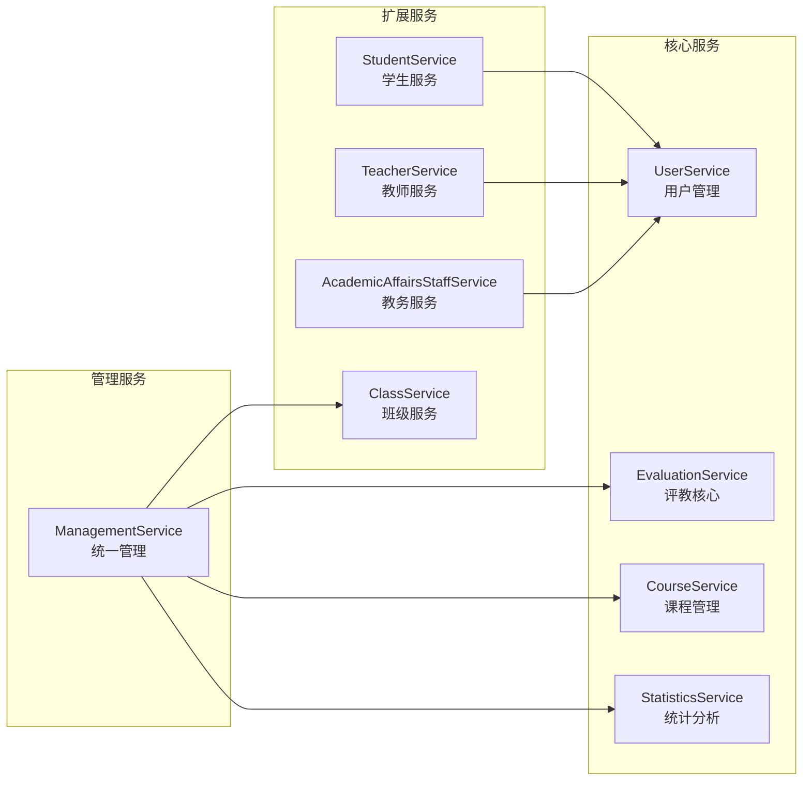
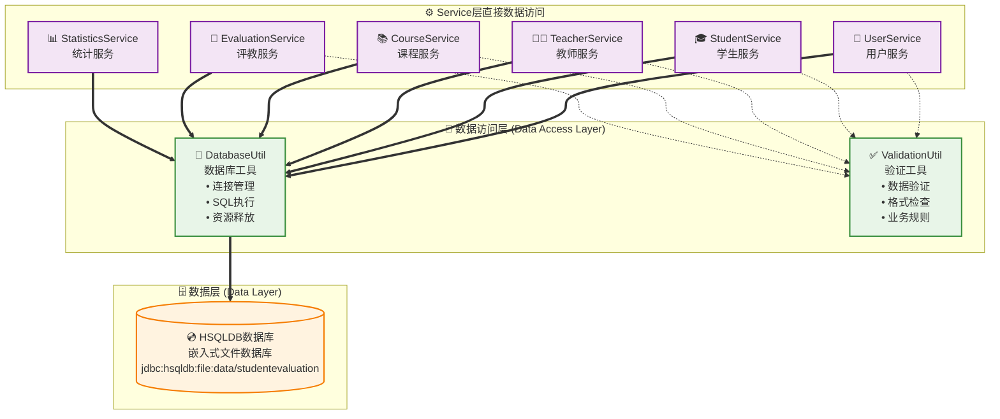
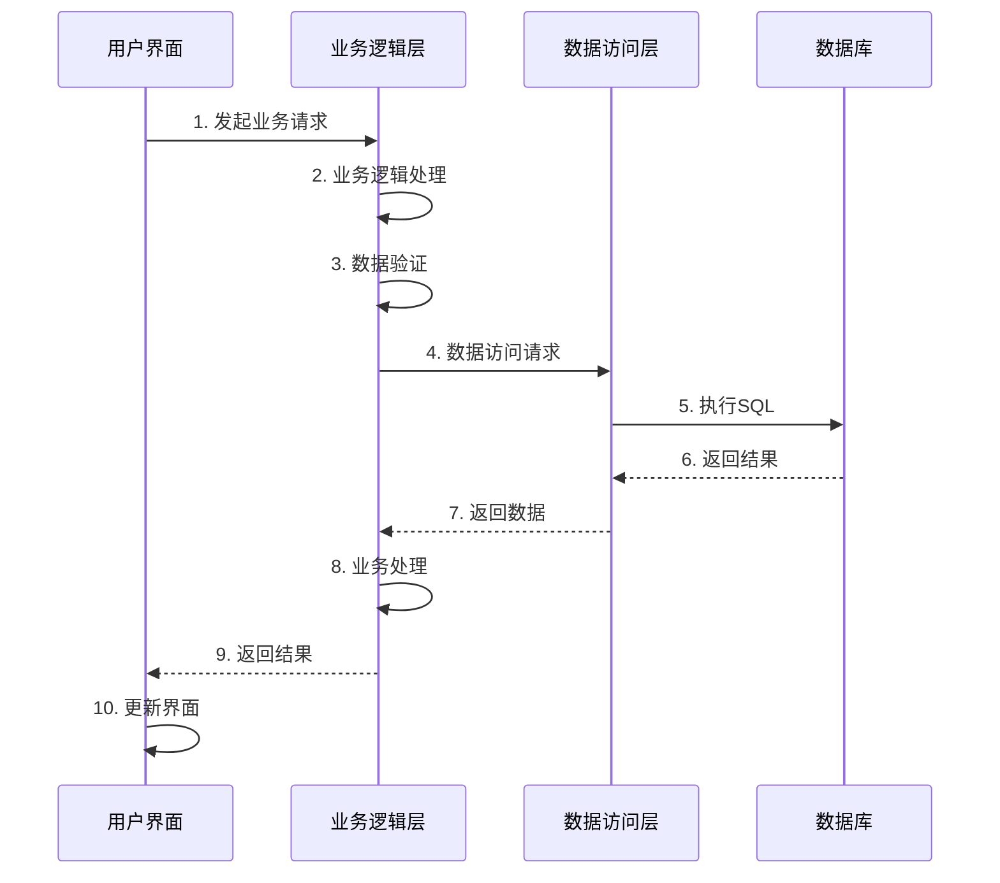
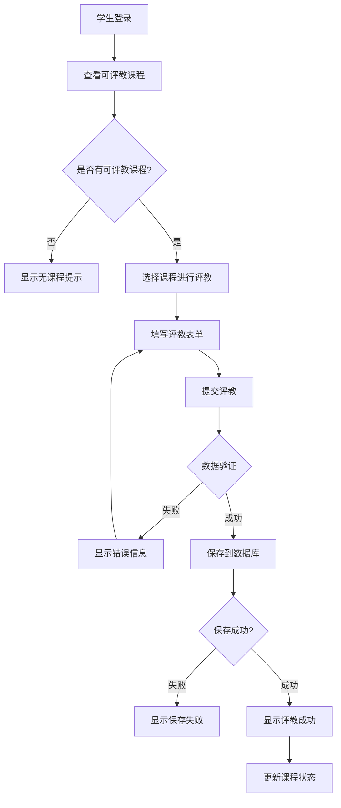
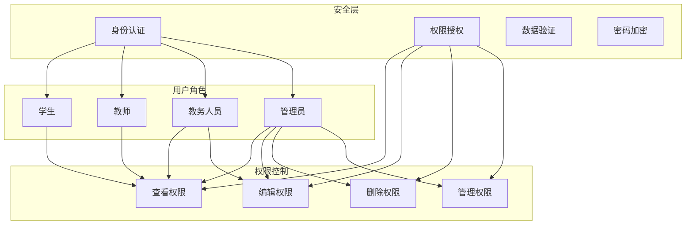
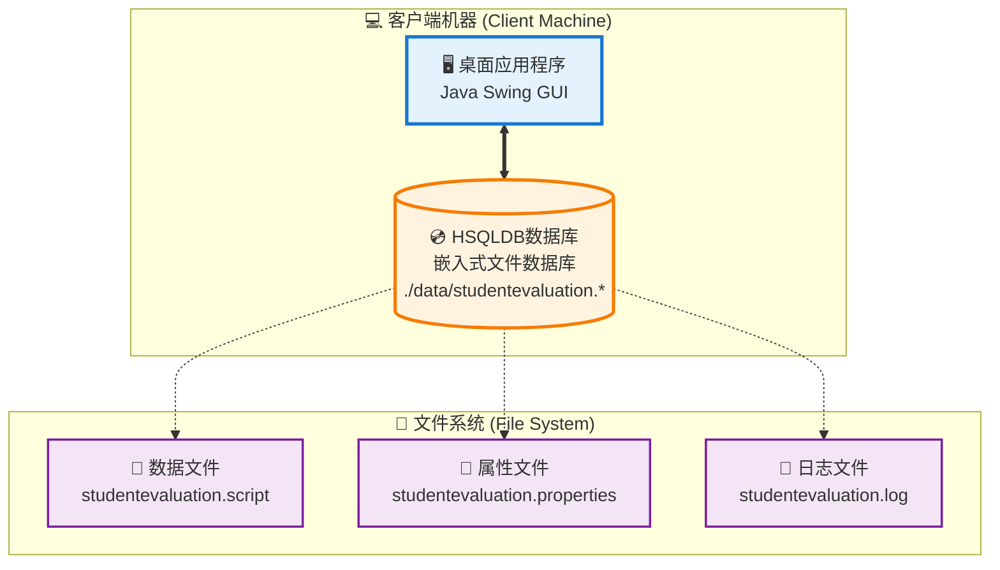
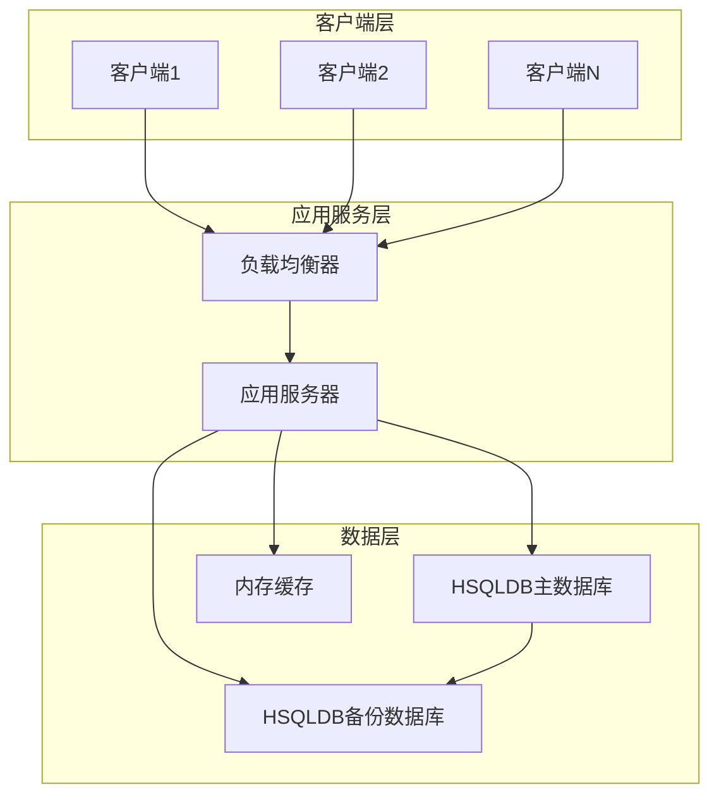

# 学生评教管理系统 - 系统架构设计

## 1. 系统架构概述

### 1.1 架构风格
本系统采用**分层架构**（Layered Architecture）模式，结合**MVS**（Model-View-Service）设计模式，确保系统的可维护性、可扩展性和可测试性。

### 1.2 架构原则
- **单一职责原则**: 每个类和模块只负责一个功能
- **开闭原则**: 对扩展开放，对修改关闭
- **依赖倒置原则**: 依赖抽象而不是具体实现
- **接口隔离原则**: 使用多个专门的接口
- **最少知识原则**: 减少类之间的耦合

## 2. 系统分层架构

```mermaid
graph TB
    subgraph "🖥️ 表示层 (Presentation Layer)"
        direction LR
        UI1["📱 学生界面<br/>StudentMainFrame"]
        UI2["👨‍🏫 教师界面<br/>TeacherMainFrame"]
        UI3["👩‍💼 教务界面<br/>StaffMainFrame"]
        UI4["🔧 管理界面<br/>AdminMainFrame"]
        UI5["🔐 登录界面<br/>LoginFrame"]
        UI6["🛠️ 通用组件<br/>ManagementUIHelper"]
    end

    subgraph "⚙️ 业务逻辑层 (Business Logic Layer)"
        direction LR
        BL1["👤 用户服务<br/>UserService"]
        BL2["🎓 学生服务<br/>StudentService"]
        BL3["👨‍🏫 教师服务<br/>TeacherService"]
        BL4["📚 课程服务<br/>CourseService"]
        BL5["📝 评教服务<br/>EvaluationService"]
        BL6["📊 统计服务<br/>StatisticsService"]
        BL7["🔧 管理服务<br/>ManagementService"]
        BL8["👩‍💼 教务服务<br/>AcademicAffairsStaffService"]
        BL9["🏫 班级服务<br/>ClassService"]
    end

    subgraph "💾 数据访问层 (Data Access Layer)"
        direction LR
        DA1["🔗 数据库工具<br/>DatabaseUtil"]
        DA2["✅ 验证工具<br/>ValidationUtil"]
    end

    subgraph "🗄️ 数据层 (Data Layer)"
        DB[("💿 HSQLDB数据库<br/>嵌入式文件数据库")]
    end

    subgraph "📋 模型层 (Model Layer)"
        direction LR
        M1["👥 用户模型<br/>User, Student, Teacher"]
        M2["📖 课程模型<br/>Course, CourseOffering"]
        M3["📝 评教模型<br/>Evaluation, EvaluationPeriod"]
        M4["🏷️ 其他模型<br/>ClassRoom, EvaluationCriteria"]
    end
    
    %% 层间依赖关系 - 清晰的垂直流向
    UI1 -.-> BL1
    UI1 -.-> BL2
    UI1 -.-> BL4
    UI1 -.-> BL5

    UI2 -.-> BL1
    UI2 -.-> BL3
    UI2 -.-> BL4
    UI2 -.-> BL5
    UI2 -.-> BL6

    UI3 -.-> BL1
    UI3 -.-> BL7
    UI3 -.-> BL8
    UI6 -.-> BL7

    UI4 -.-> BL1
    UI4 -.-> BL2
    UI4 -.-> BL3
    UI4 -.-> BL4
    UI4 -.-> BL5
    UI4 -.-> BL6
    UI4 -.-> BL7
    UI4 -.-> BL9

    UI5 -.-> BL1

    %% Service层到数据访问层
    BL1 ==> DA1
    BL2 ==> DA1
    BL3 ==> DA1
    BL4 ==> DA1
    BL5 ==> DA1
    BL6 ==> DA1
    BL7 ==> DA1
    BL8 ==> DA1
    BL9 ==> DA1

    %% 数据访问层到数据库
    DA1 ==> DB
    DA2 -.-> DA1

    %% 样式定义
    classDef uiLayer fill:#e3f2fd,stroke:#1976d2,stroke-width:3px,color:#000
    classDef serviceLayer fill:#f3e5f5,stroke:#7b1fa2,stroke-width:3px,color:#000
    classDef dataLayer fill:#e8f5e8,stroke:#388e3c,stroke-width:3px,color:#000
    classDef dbLayer fill:#fff3e0,stroke:#f57c00,stroke-width:3px,color:#000
    classDef modelLayer fill:#fce4ec,stroke:#c2185b,stroke-width:3px,color:#000

    class UI1,UI2,UI3,UI4,UI5,UI6 uiLayer
    class BL1,BL2,BL3,BL4,BL5,BL6,BL7,BL8,BL9 serviceLayer
    class DA1,DA2 dataLayer
    class DB dbLayer
    class M1,M2,M3,M4 modelLayer
    
    BL1 -.-> M1
    BL2 -.-> M1
    BL3 -.-> M1
    BL4 -.-> M2
    BL5 -.-> M3
    BL9 -.-> M4
```

## 3. 核心组件设计

### 3.1 表示层 (Presentation Layer)

#### 3.1.1 职责
- 用户界面展示
- 用户交互处理
- 数据格式化显示
- 输入验证

#### 3.1.2 主要组件
- **LoginFrame**: 统一登录入口
- **StudentMainFrame**: 学生功能界面
- **TeacherMainFrame**: 教师功能界面
- **StaffMainFrame**: 教务人员功能界面
- **AdminMainFrame**: 管理员功能界面
- **ManagementUIHelper**: 通用管理UI组件

#### 3.1.3 设计特点
- 采用Swing技术实现桌面应用
- 统一的UI风格和交互模式
- 响应式布局适配不同屏幕
- 国际化支持（预留）

### 3.2 业务逻辑层 (Business Logic Layer)

#### 3.2.1 职责
- 业务规则实现
- 数据处理和转换
- 业务流程控制
- 权限验证

#### 3.2.2 服务组件设计

#### 3.2.3 业务规则
- **评教规则**: 学生只能在评教周期内对选修课程进行一次评教
- **权限规则**: 不同角色具有不同的功能权限
- **数据规则**: 评分必须在有效范围内，权重总和为100%
- **时间规则**: 评教周期不能重叠，开始时间必须早于结束时间

### 3.3 数据访问层 (Data Access Layer)

#### 3.3.1 职责
- 数据库连接管理
- SQL语句执行
- 事务管理
- 连接池维护

#### 3.3.2 组件设计

#### 3.3.3 技术特点
- **HSQLDB嵌入式数据库**: 轻量级、高性能的嵌入式数据库
- **Service层直接数据访问**: 简化架构，Service层直接使用DatabaseUtil进行数据库操作
- **预编译语句**: 防止SQL注入，提高性能
- **连接复用**: DatabaseUtil提供连接管理和复用
- **异常处理**: 统一的数据库异常处理机制
- **工具方法**: DatabaseUtil提供executeQuery和executeUpdate便捷方法

## 4. 数据流架构

### 4.1 请求处理流程

### 4.2 评教业务流程

## 5. 安全架构

### 5.1 认证与授权

### 5.2 安全措施
- **密码加密**: 使用BCrypt算法加密存储密码
- **SQL注入防护**: 使用预编译语句
- **权限控制**: 基于角色的访问控制(RBAC)
- **数据验证**: 前端和后端双重验证
- **会话管理**: 安全的用户会话管理

## 6. 性能架构

### 6.1 性能优化策略
- **数据库优化**: 索引优化、查询优化、HSQLDB内存模式
- **缓存机制**: 内存缓存常用数据
- **异步处理**: 耗时操作异步执行
- **批量操作**: 减少数据库交互次数

### 6.2 可扩展性设计
- **模块化设计**: 功能模块独立，便于扩展
- **接口抽象**: 通过接口实现松耦合
- **配置外部化**: 系统配置可外部修改
- **插件机制**: 支持功能插件扩展

## 7. 部署架构

### 7.1 单机部署

### 7.2 分布式部署（扩展方案）

## 8. 监控与维护

### 8.1 日志架构
- **应用日志**: 记录业务操作和异常
- **性能日志**: 记录系统性能指标
- **安全日志**: 记录安全相关事件
- **审计日志**: 记录重要操作轨迹

### 8.2 监控指标
- **系统性能**: CPU、内存、磁盘使用率
- **数据库性能**: 连接数、查询响应时间
- **业务指标**: 用户活跃度、评教完成率
- **错误率**: 系统异常和错误统计
