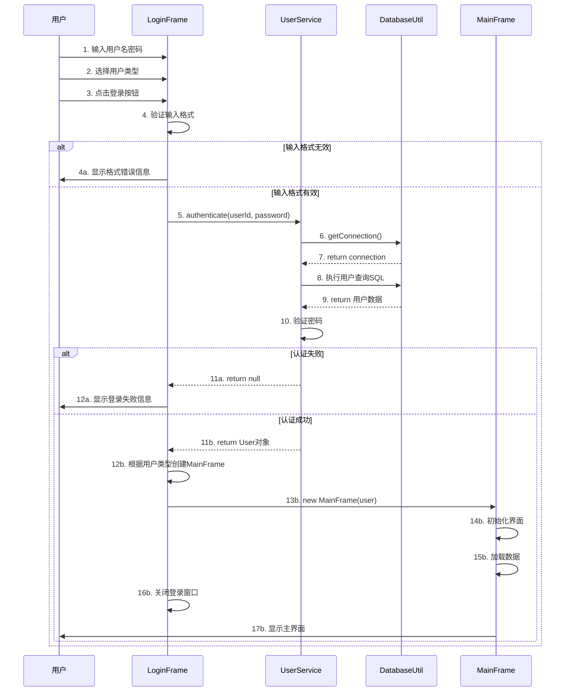
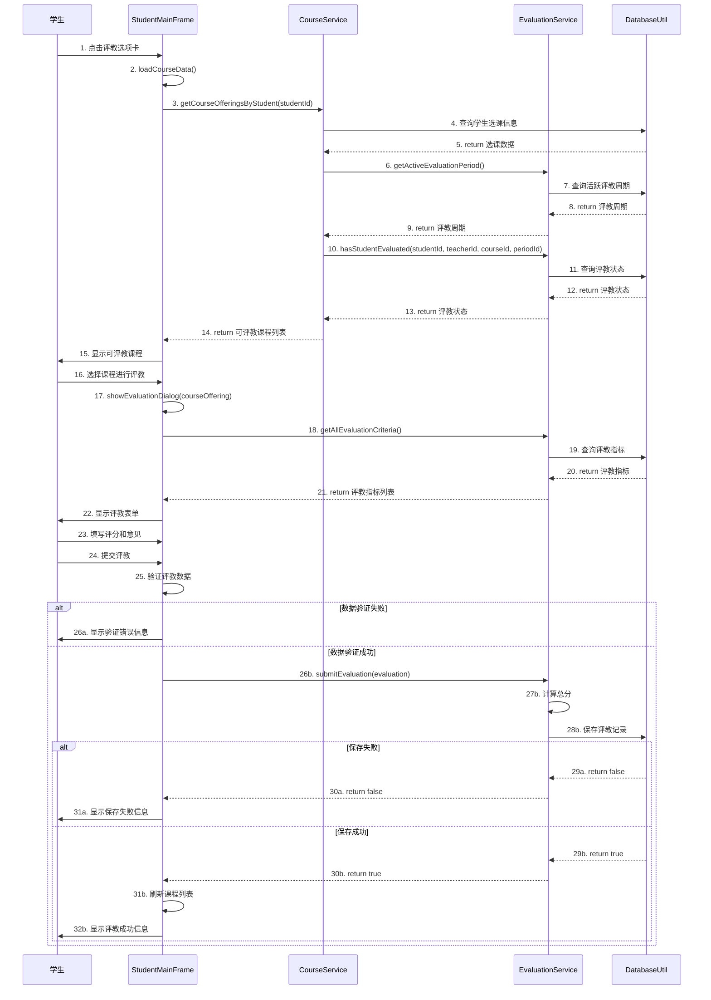
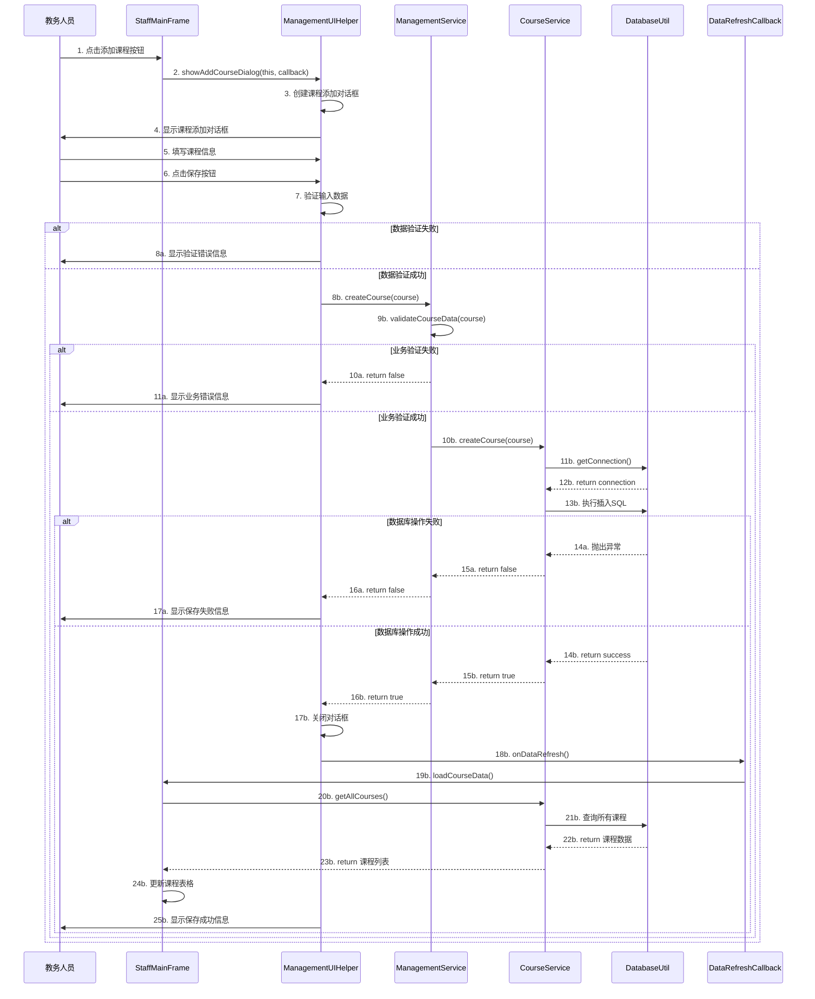
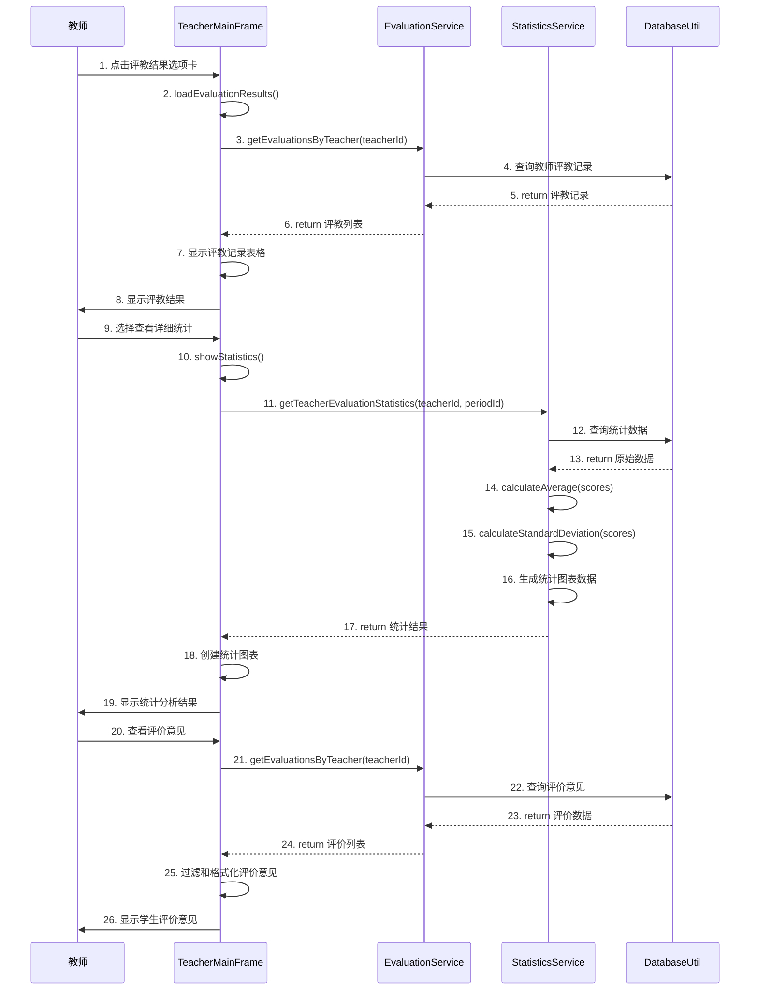
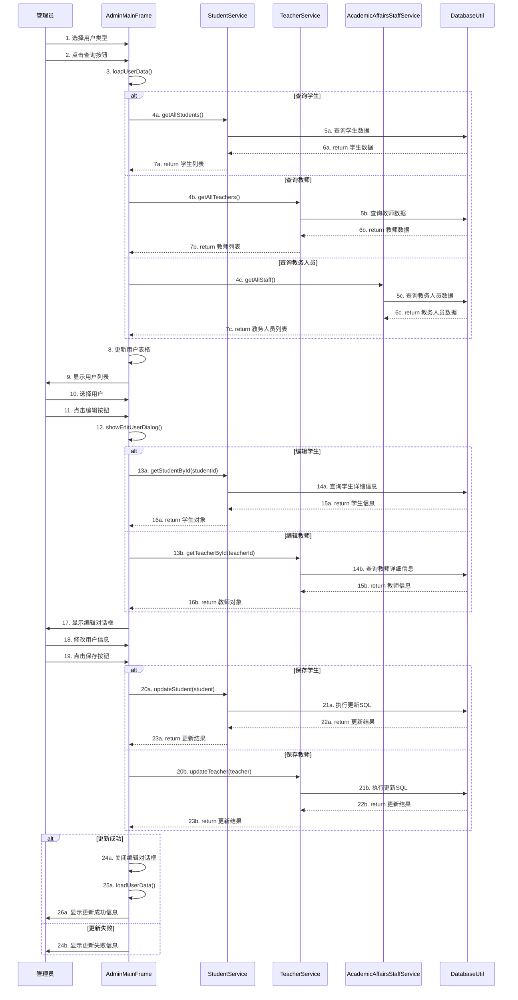

# 学生评教管理系统 - 类关系和时序图设计

## 重要说明

本文档基于实际运行的代码编写，反映系统的真实架构和设计。与理论设计文档不同，本文档专注于描述实际实现的类关系和业务流程。

### 实际架构特点
- **简化设计**: 无独立接口层，主要使用具体类
- **直接数据访问**: Service层直接使用DatabaseUtil
- **HSQLDB数据库**: 嵌入式数据库，简化部署
- **移除冗余字段**: 去除了不必要的时间戳和联系方式字段

## 1. 实际类关系图

### 1.1 核心类关系图（基于实际代码）

```mermaid
classDiagram
    %% 抽象类
    class User {
        <<abstract>>
        #String id
        #String name
        #String gender
        #String password
        +User()
        +User(id, name, gender, password)
        +getUserType()* String
        +validatePassword(inputPassword) boolean
        +getId() String
        +getName() String
        +getGender() String
        +getPassword() String
        +setId(id) void
        +setName(name) void
        +setGender(gender) void
        +setPassword(password) void
        +toString() String
        +equals(obj) boolean
        +hashCode() int
    }
    
    %% 实体类 - 用户体系
    class Student {
        -String grade
        -String major
        -String classId
        +Student()
        +Student(studentId, name, gender, grade, major, classId, password)
        +getUserType() String
        +getStudentId() String
        +setStudentId(studentId) void
        +getGrade() String
        +setGrade(grade) void
        +getMajor() String
        +setMajor(major) void
        +getClassId() String
        +setClassId(classId) void
        +getFullInfo() String
        +builder() Builder$
    }

    class Teacher {
        -String title
        -String college
        +Teacher()
        +Teacher(teacherId, name, gender, title, college, password)
        +getUserType() String
        +getTeacherId() String
        +setTeacherId(teacherId) void
        +getTitle() String
        +setTitle(title) void
        +getCollege() String
        +setCollege(college) void
        +getFullInfo() String
    }

    class AcademicAffairsStaff {
        -String department
        -String position
        +AcademicAffairsStaff()
        +AcademicAffairsStaff(staffId, name, gender, department, position, password)
        +getUserType() String
        +getStaffId() String
        +setStaffId(staffId) void
        +getDepartment() String
        +setDepartment(department) void
        +getPosition() String
        +setPosition(position) void
        +getFullInfo() String
    }

    class Administrator {
        +Administrator()
        +Administrator(adminId, name, gender, password)
        +getUserType() String
        +getAdminId() String
        +setAdminId(adminId) void
    }
    
    %% 实体类 - 课程体系
    class Course {
        -String courseId
        -String courseName
        -double credits
        -String courseType
        -String college
        +Course()
        +Course(courseId, courseName, credits, courseType, college)
        +getCourseId() String
        +setCourseId(courseId) void
        +getCourseName() String
        +setCourseName(courseName) void
        +getCredits() double
        +setCredits(credits) void
        +getCourseType() String
        +setCourseType(courseType) void
        +getCollege() String
        +setCollege(college) void
        +getFullInfo() String
        +toString() String
        +equals(obj) boolean
        +hashCode() int
    }

    class ClassRoom {
        -String classId
        -String className
        -String grade
        -String major
        -String college
        -int studentCount
        +ClassRoom()
        +ClassRoom(classId, className, grade, major, college)
        +getClassId() String
        +setClassId(classId) void
        +getClassName() String
        +setClassName(className) void
        +getGrade() String
        +setGrade(grade) void
        +getMajor() String
        +setMajor(major) void
        +getCollege() String
        +setCollege(college) void
        +getStudentCount() int
        +setStudentCount(count) void
        +incrementStudentCount() void
        +decrementStudentCount() void
        +getFullInfo() String
        +toString() String
        +equals(obj) boolean
        +hashCode() int
    }

    class CourseOffering {
        -String offeringId
        -Course course
        -Teacher teacher
        -ClassRoom classRoom
        -String semester
        -String schedule
        +CourseOffering()
        +CourseOffering(offeringId, courseId, teacherId, classId, semester, schedule)
        +getOfferingId() String
        +setOfferingId(offeringId) void
        +getCourse() Course
        +setCourse(course) void
        +getTeacher() Teacher
        +setTeacher(teacher) void
        +getClassRoom() ClassRoom
        +setClassRoom(classRoom) void
        +getSemester() String
        +setSemester(semester) void
        +getSchedule() String
        +setSchedule(schedule) void
        +getFullInfo() String
        +toString() String
        +equals(obj) boolean
        +hashCode() int
    }
    
    class EvaluationPeriod {
        -String periodId
        -String periodName
        -String semester
        -LocalDate startDate
        -LocalDate endDate
        -String status
        -LocalDateTime createdAt
        +EvaluationPeriod(periodId, periodName, semester, startDate, endDate)
        +isActive() boolean
        +start() boolean
        +end() boolean
        +validateDates() boolean
    }
    
    class EvaluationCriteria {
        -String criteriaId
        -String criteriaName
        -String description
        -double weight
        -int maxScore
        -LocalDateTime createdAt
        +EvaluationCriteria(criteriaId, criteriaName, description, weight, maxScore)
        +validateWeight() boolean
        +calculateWeightedScore(score) double
        +validateScore(score) boolean
    }
    
    class Evaluation {
        -String evaluationId
        -String studentId
        -String teacherId
        -String courseId
        -String periodId
        -String criteriaScores
        -double totalScore
        -String comments
        -LocalDateTime createdAt
        +Evaluation(evaluationId, studentId, teacherId, courseId, periodId)
        +setCriteriaScore(criteriaId, score) void
        +getCriteriaScore(criteriaId) int
        +calculateTotalScore(criteriaList) double
        +validateData() boolean
        +getGrade() String
    }
    
    %% 服务类
    class UserService {
        -Connection connection
        +UserService()
        +authenticate(userId, password) User
        +hasPermission(user, permission) boolean
        +changePassword(userId, oldPassword, newPassword) boolean
        +getUserById(userId) User
        +getAllUsers() List~User~
        -hashPassword(password) String
        -verifyPassword(password, hash) boolean
    }
    
    class StudentService {
        -Connection connection
        +StudentService()
        +registerStudent(student) boolean
        +getStudentById(studentId) Student
        +updateStudent(student) boolean
        +deleteStudent(studentId) boolean
        +getAllStudents() List~Student~
        +getStudentsByClass(classId) List~Student~
        +getStudentCountByClass(classId) int
    }
    
    class TeacherService {
        -Connection connection
        +TeacherService()
        +registerTeacher(teacher) boolean
        +getTeacherById(teacherId) Teacher
        +updateTeacher(teacher) boolean
        +deleteTeacher(teacherId) boolean
        +getAllTeachers() List~Teacher~
        +getTeachersByCollege(college) List~Teacher~
    }
    
    class CourseService {
        -Connection connection
        +CourseService()
        +createCourse(course) boolean
        +getCourseById(courseId) Course
        +updateCourse(course) boolean
        +deleteCourse(courseId) boolean
        +getAllCourses() List~Course~
        +createCourseOffering(offering) boolean
        +getAllCourseOfferings() List~CourseOffering~
        +getCourseOfferingsByTeacher(teacherId) List~CourseOffering~
        +getCourseOfferingsByStudent(studentId) List~CourseOffering~
    }
    
    class EvaluationService {
        -Connection connection
        +EvaluationService()
        +submitEvaluation(evaluation) boolean
        +hasStudentEvaluated(studentId, teacherId, courseId, periodId) boolean
        +getEvaluationsByStudent(studentId) List~Evaluation~
        +getEvaluationsByTeacher(teacherId) List~Evaluation~
        +getActiveEvaluationPeriod() EvaluationPeriod
        +createEvaluationPeriod(period) boolean
        +updateEvaluationPeriod(period) boolean
        +getAllEvaluationPeriods() List~EvaluationPeriod~
        +createEvaluationCriteria(criteria) boolean
        +updateEvaluationCriteria(criteria) boolean
        +deleteEvaluationCriteria(criteriaId) boolean
        +getAllEvaluationCriteria() List~EvaluationCriteria~
    }
    
    class StatisticsService {
        -Connection connection
        +StatisticsService()
        +calculateAverage(scores) double
        +calculateStandardDeviation(scores) double
        +generateReport(data) String
        +getTeacherEvaluationStatistics(teacherId, periodId) Map~String,Object~
        +getCourseEvaluationStatistics(courseId, periodId) Map~String,Object~

        +getOverallEvaluationStatistics(periodId) Map~String,Object~
        +getEvaluationTrends(teacherId, periods) List~Map~String,Object~~
    }
    
    class ManagementService {
        -CourseService courseService
        -EvaluationService evaluationService
        -ClassService classService
        -StatisticsService statisticsService
        +ManagementService()
        +createCourse(course) boolean
        +updateCourse(course) boolean
        +deleteCourse(courseId) boolean
        +getAllCourses() List~Course~
        +getCourseById(courseId) Course
        +createEvaluationPeriod(period) boolean
        +updateEvaluationPeriod(period) boolean
        +getAllEvaluationPeriods() List~EvaluationPeriod~
        +createEvaluationCriteria(criteria) boolean
        +updateEvaluationCriteria(criteria) boolean
        +deleteEvaluationCriteria(criteriaId) boolean
        +getAllEvaluationCriteria() List~EvaluationCriteria~
        +validateCourseData(course) boolean
        +validateEvaluationPeriodData(period) boolean
        +validateEvaluationCriteriaData(criteria) boolean
    }
    
    %% UI类
    class LoginFrame {
        -JTextField userIdField
        -JPasswordField passwordField
        -JComboBox~String~ userTypeComboBox
        -JButton loginButton
        -UserService userService
        +LoginFrame()
        -initializeComponents() void
        -setupLayout() void
        -setupEventListeners() void
        -handleLogin() void
        -openMainFrame(user) void
    }
    
    class StudentMainFrame {
        -Student currentStudent
        -StudentService studentService
        -CourseService courseService
        -EvaluationService evaluationService
        -JTable courseTable
        -JTable evaluationHistoryTable
        +StudentMainFrame(user)
        +initializeComponents() void
        +setupLayout() void
        +loadData() void
        -loadCourseData() void
        -loadEvaluationHistory() void
        -showEvaluationDialog(courseOffering) void
    }
    
    class TeacherMainFrame {
        -Teacher currentTeacher
        -TeacherService teacherService
        -CourseService courseService
        -EvaluationService evaluationService
        -StatisticsService statisticsService
        -JTable courseTable
        -JTable evaluationTable
        +TeacherMainFrame(user)
        +initializeComponents() void
        +setupLayout() void
        +loadData() void
        -loadTeachingCourses() void
        -loadEvaluationResults() void
        -showEvaluationDetails(evaluation) void
        -showStatistics() void
    }
    
    class StaffMainFrame {
        -AcademicAffairsStaff currentStaff
        -ManagementUIHelper managementUIHelper
        -CourseService courseService
        -EvaluationService evaluationService
        -StatisticsService statisticsService
        -JTable courseTable
        -JTable evaluationPeriodTable
        +StaffMainFrame(user)
        +initializeComponents() void
        +setupLayout() void
        +loadData() void
        -createCourseManagementPanel() JPanel
        -createEvaluationManagementPanel() JPanel
        -loadCourseData() void
        -loadEvaluationPeriodData() void
        -showEvaluationStatistics() void
    }
    
    class AdminMainFrame {
        -Administrator currentAdmin
        -ManagementUIHelper managementUIHelper
        -StudentService studentService
        -TeacherService teacherService
        -CourseService courseService
        -EvaluationService evaluationService
        -StatisticsService statisticsService
        -JTable userTable
        -JTable courseTable
        -JTable evaluationTable
        +AdminMainFrame(user)
        +initializeComponents() void
        +setupLayout() void
        +loadData() void
        -createUserManagementPanel() JPanel
        -createCourseManagementPanel() JPanel
        -createEvaluationManagementPanel() JPanel
        -loadUserData() void
        -loadCourseData() void
        -loadEvaluationData() void
        -showSystemStatistics() void
    }
    
    class ManagementUIHelper {
        -ManagementService managementService
        +ManagementUIHelper()
        +showAddCourseDialog(parent, callback) void
        +showEditCourseDialog(parent, courseId, callback) void
        +deleteCourse(parent, courseId, callback) void
        +showAddEvaluationPeriodDialog(parent, callback) void
        +showEditEvaluationPeriodDialog(parent, periodId, callback) void
        +showEvaluationCriteriaDialog(parent) void
        +setupTableStyle(table) void
        +getGradeByScore(score) String
        +getGradeColor(grade) Color
        +showSuccessMessage(parent, message) void
        +showErrorMessage(parent, message) void
        +showWarningMessage(parent, message) void
    }
    
    class DatabaseUtil {
        -static final String DB_URL
        -static final String DB_USER
        -static final String DB_PASSWORD
        -DatabaseUtil()
        +getConnection() Connection
        +closeConnection(connection) void
        +closeResources(rs, stmt, conn) void
        +initializeTables() void
        +shutdown() void
    }
    
    %% 继承关系
    User <|-- Student
    User <|-- Teacher
    User <|-- AcademicAffairsStaff
    User <|-- Administrator
    
    BaseMainFrame <|-- StudentMainFrame
    BaseMainFrame <|-- TeacherMainFrame
    BaseMainFrame <|-- StaffMainFrame
    BaseMainFrame <|-- AdminMainFrame
    
    %% 实现关系
    UserService ..|> AuthenticationService
    EvaluationService ..|> EvaluationServiceInterface
    StatisticsService ..|> StatisticsAnalyzer
    
    %% 组合关系
    Student "n" --> "1" ClassRoom : belongs to
    CourseOffering "n" --> "1" Course : offers
    CourseOffering "n" --> "1" Teacher : taught by
    CourseOffering "n" --> "1" ClassRoom : for class
    Evaluation "n" --> "1" Student : evaluated by
    Evaluation "n" --> "1" Teacher : evaluates
    Evaluation "n" --> "1" Course : for course
    Evaluation "n" --> "1" EvaluationPeriod : in period
    
    %% 依赖关系
    ManagementService --> CourseService
    ManagementService --> EvaluationService
    ManagementService --> StatisticsService
    
    StaffMainFrame --> ManagementUIHelper
    AdminMainFrame --> ManagementUIHelper
    ManagementUIHelper --> ManagementService
    
    LoginFrame --> UserService
    StudentMainFrame --> StudentService
    StudentMainFrame --> CourseService
    StudentMainFrame --> EvaluationService
    TeacherMainFrame --> TeacherService
    TeacherMainFrame --> CourseService
    TeacherMainFrame --> EvaluationService
    TeacherMainFrame --> StatisticsService
```



## 2. 关键时序图设计

### 2.1 用户登录时序图



### 2.2 学生评教时序图



### 2.3 教务人员课程管理时序图



### 2.4 教师查看评教结果时序图



### 2.5 管理员用户管理时序图



## 3. 类关系说明

### 3.1 继承关系
- **User抽象类**: Student, Teacher, AcademicAffairsStaff, Administrator都继承自User
- **BaseMainFrame抽象类**: 所有主界面类都继承自BaseMainFrame，提供通用的界面框架

### 3.2 实际架构特点
- **无接口抽象**: 大部分Service类没有对应的接口，直接提供具体实现
- **简化设计**: 减少抽象层次，提高开发效率
- **直接实现**: Service类直接实现业务逻辑，无需接口约束

### 3.3 组合关系
- **学生与班级**: 学生属于班级，多对一关系
- **开课与课程/教师/班级**: 开课关联课程、教师和班级，多对一关系
- **评教与学生/教师/课程/周期**: 评教记录关联学生、教师、课程和评教周期

### 3.4 依赖关系
- **ManagementService**: 依赖CourseService、EvaluationService等服务类
- **UI类**: 依赖相应的Service类获取数据和执行业务操作
- **ManagementUIHelper**: 依赖ManagementService提供统一的管理功能
- **所有Service类**: 直接依赖DatabaseUtil进行数据库操作

### 3.5 数据访问模式
- **Service层直接数据访问**: 各Service类直接使用DatabaseUtil进行数据库操作
- **无DAO层**: 简化架构，减少抽象层次
- **统一工具类**: DatabaseUtil提供统一的数据库连接和操作方法

## 4. 实际设计模式体现

### 4.1 工具类模式
- **DatabaseUtil**: 提供静态方法进行数据库操作，包含连接管理和SQL执行
- **ValidationUtil**: 提供静态验证方法

### 4.2 观察者模式
- **DataRefreshCallback**: 数据变更时通知界面刷新

### 4.3 外观模式
- **ManagementService**: 为管理功能提供统一的接口
- **ManagementUIHelper**: 为管理界面提供统一的UI组件

### 4.4 简化的数据访问模式
```java
// 典型的Service层数据访问模式
public class StudentService {
    public Student getStudentById(String studentId) {
        try {
            String sql = "SELECT * FROM students WHERE student_id = ?";
            try (Connection conn = DatabaseUtil.getConnection();
                 PreparedStatement pstmt = conn.prepareStatement(sql)) {

                pstmt.setString(1, studentId);
                ResultSet rs = pstmt.executeQuery();

                if (rs.next()) {
                    // 直接构建对象返回
                    return buildStudentFromResultSet(rs);
                }
            }
        } catch (SQLException e) {
            System.err.println("数据库错误: " + e.getMessage());
        }
        return null;
    }
}
```

### 4.5 架构优势
- **简单直接**: 无复杂的抽象层，代码易于理解和维护
- **高效开发**: 减少接口定义和实现的开发工作量
- **统一管理**: DatabaseUtil统一管理所有数据库操作
- **易于调试**: 数据访问逻辑集中在Service层，便于问题定位

## 5. 文档更新说明

### 5.1 重要更新内容

本文档已根据实际运行的代码进行了重大更新，确保与实际实现完全一致：

#### 5.1.1 类关系图更新
- **移除理论接口**: 删除了实际代码中不存在的BaseDAO、AuthenticationService等接口
- **更新实体类**: 所有实体类的属性和方法都与实际代码保持一致
- **移除时间戳字段**: 删除了created_at和updated_at字段的描述
- **简化Service类**: 反映实际的Service层设计

#### 5.1.2 架构关系更新
- **直接数据访问**: Service层直接使用DatabaseUtil，无独立DAO层
- **组合关系调整**: 更新了Evaluation与CourseOffering的关系
- **简化依赖关系**: 移除了复杂的接口依赖，使用直接的类依赖

### 5.2 实际系统特点

#### 5.2.1 简化设计优势
- **降低复杂度**: 减少抽象层次，提高开发效率
- **易于理解**: 代码结构清晰，便于维护
- **快速开发**: 专注核心功能，避免过度设计
- **部署简单**: 嵌入式数据库，无需复杂配置

#### 5.2.2 技术架构特点
- **HSQLDB数据库**: 嵌入式数据库，简化部署
- **MVS架构**: Model-View-Service三层架构
- **直接JDBC**: 使用原生JDBC，性能优异
- **工具类模式**: DatabaseUtil和ValidationUtil提供通用功能

### 5.3 文档一致性保证

本文档现在完全反映了实际代码的结构和实现：
- **类关系图**: 与实际的继承、组合关系一致
- **方法签名**: 与实际代码中的方法完全匹配
- **数据流程**: 反映真实的业务处理流程
- **技术架构**: 基于HSQLDB的实际技术栈

## 6. 总结

本类关系和时序图设计文档基于实际运行的代码编写，准确反映了学生评教管理系统的真实架构和业务流程。通过简化的设计和清晰的关系图，展示了系统各组件之间的实际关系和交互方式。

### 6.1 设计亮点
- **实用性强**: 基于实际代码，确保文档的准确性
- **结构清晰**: 简化的类关系，易于理解和维护
- **业务完整**: 覆盖了评教管理的核心业务流程
- **技术合理**: 采用成熟的技术栈和设计模式

### 6.2 技术价值
- **参考价值**: 为类似系统的设计提供参考
- **维护指南**: 为系统维护提供技术文档
- **扩展基础**: 为功能扩展提供架构基础
- **学习资源**: 为Java桌面应用开发提供学习案例

这些设计和文档确保了系统的稳定性、可维护性和可扩展性，为学生评教管理提供了坚实的技术基础。
