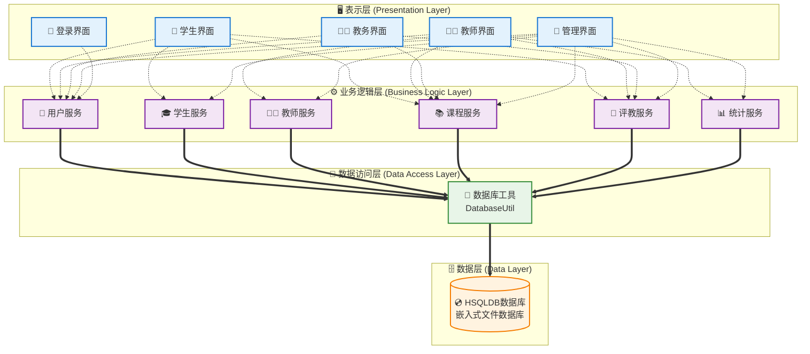

# 学生评教管理系统 - 设计文档

## 文档概述

本目录包含学生评教管理系统的完整设计文档，涵盖了系统分析、设计和实现的各个方面。

## 文档结构

### 1. [用例图和用例规约](./01-用例图和用例规约.md)
- **内容**: 系统用例分析、用例图、详细用例规约
- **包含**:
  - 总体用例图
  - 各子系统用例图（学生、教师、教务人员、管理员）
  - 主要用例的详细规约
  - 用例关系说明（包含、扩展、泛化）

### 2. [数据库设计](./02-数据库设计.md)
- **内容**: 完整的数据库设计方案
- **包含**:
  - 数据库表结构设计
  - 实体关系图(ERD)
  - 索引设计
  - 数据完整性约束
  - 初始化脚本
  - 维护策略

### 3. [类设计](./03-类设计.md)
- **内容**: 系统的面向对象设计
- **包含**:
  - 系统架构概述
  - 核心类图（Model、Service、UI层）
  - 设计模式应用
  - 关键接口设计
  - 类的职责说明
  - 数据流设计
  - 异常处理设计

### 4. [系统架构设计](./04-系统架构设计.md)
- **内容**: 系统整体架构设计
- **包含**:
  - 分层架构设计
  - 核心组件设计
  - 数据流架构
  - 安全架构
  - 性能架构
  - 部署架构
  - 监控与维护

### 5. [详细类接口设计](./05-详细类接口设计.md)
- **内容**: 系统所有类和接口的详细设计
- **包含**:
  - 核心接口定义（BaseDAO、AuthenticationService、EvaluationServiceInterface等）
  - 实体类设计（User体系、Course体系、Evaluation体系）
  - 服务层类设计（UserService、EvaluationService、StatisticsService等）
  - UI层类设计（各MainFrame、ManagementUIHelper）
  - 工具类设计（DatabaseUtil）
  - 每个类的属性、方法和功能描述

### 6. [类关系和时序图设计](./06-类关系和时序图设计.md)
- **内容**: 类之间的关系和关键业务流程的时序图
- **包含**:
  - 整体类关系图（继承、实现、组合、依赖关系）
  - 关键时序图（用户登录、学生评教、课程管理、评教结果查看、用户管理）
  - 类关系详细说明
  - 设计模式体现

### 7. [实际技术栈说明](./07-实际技术栈说明.md)
- **内容**: 项目实际使用的技术栈和实现细节
- **包含**:
  - 实际技术栈详情（HSQLDB、Java Swing、Maven）
  - 数据库连接方式和配置
  - 项目结构和文件组织
  - 实际数据库表结构（HSQLDB语法）
  - 与设计文档的对应关系
  - 部署和运行说明
  - 技术优势分析

### 8. [文档修正说明](./08-文档修正说明.md)
- **内容**: 文档修正的详细说明和对比
- **包含**:
  - 修正背景和原因
  - 主要修正内容对比（技术栈、架构设计、类设计、数据库设计）
  - 修正前后的架构对比
  - 实际项目特点和优势
  - 文档一致性保证措施
  - 修正原则和验证方法

## 系统特点

### 技术特点
- **架构模式**: MVS (Model-View-Service) 三层架构
- **开发语言**: Java 17+
- **UI框架**: Java Swing
- **数据库**: HSQLDB 2.7.1 (嵌入式数据库)
- **连接方式**: 直接JDBC连接
- **构建工具**: Maven

### 功能特点
- **多角色支持**: 学生、教师、教务人员、管理员
- **完整评教流程**: 周期管理、指标设置、评教提交、结果统计
- **权限控制**: 基于角色的访问控制
- **数据统计**: 多维度评教数据分析
- **用户管理**: 完整的用户生命周期管理

### 设计特点
- **模块化设计**: 功能模块独立，便于维护和扩展
- **代码重用**: 抽象公共功能，减少重复代码
- **异常处理**: 完善的异常处理机制
- **数据验证**: 前端和后端双重数据验证
- **安全性**: 密码加密、SQL注入防护

## 系统架构概览



## 核心业务流程

### 1. 用户认证流程
```
登录界面 → 身份验证 → 角色识别 → 跳转对应主界面
```

### 2. 评教业务流程
```
学生登录 → 查看课程 → 选择评教 → 填写表单 → 提交保存 → 完成评教
```

### 3. 管理业务流程
```
管理员/教务人员登录 → 选择管理功能 → 执行操作 → 数据更新 → 结果反馈
```

## 数据模型概览

### 核心实体
- **用户体系**: User(抽象) → Student, Teacher, AcademicAffairsStaff, Administrator
- **课程体系**: Course, CourseOffering, ClassRoom
- **评教体系**: EvaluationPeriod, EvaluationCriteria, Evaluation

### 关键关系
- 学生属于班级，选修课程
- 教师授课，接受评教
- 评教在特定周期内进行
- 评教结果用于统计分析

## 质量保证

### 代码质量
- **编码规范**: 遵循Java编码规范
- **注释完整**: 类、方法、关键逻辑都有详细注释
- **异常处理**: 完善的异常捕获和处理机制
- **资源管理**: 及时释放数据库连接等资源

### 数据质量
- **数据验证**: 多层次数据验证机制
- **事务管理**: 保证数据一致性
- **备份策略**: 定期数据备份
- **完整性约束**: 数据库层面的完整性保证

### 安全质量
- **权限控制**: 严格的角色权限管理
- **密码安全**: 密码加密存储
- **SQL安全**: 预编译语句防注入
- **会话管理**: 安全的用户会话控制

## 扩展性考虑

### 功能扩展
- **新角色添加**: 通过继承User类轻松添加新角色
- **新功能模块**: 模块化设计便于添加新功能
- **评教指标**: 灵活的评教指标配置机制
- **统计维度**: 可扩展的统计分析维度

### 技术扩展
- **数据库迁移**: 通过DAO层抽象支持数据库迁移
- **UI框架**: 表示层独立，可替换UI技术
- **分布式部署**: 预留分布式部署接口
- **缓存机制**: 可集成Redis等缓存技术

## 维护指南

### 日常维护
- **数据备份**: 定期备份数据库
- **日志监控**: 监控系统运行日志
- **性能监控**: 关注系统性能指标
- **用户反馈**: 及时处理用户问题

### 版本升级
- **数据库升级**: 提供数据库升级脚本
- **功能升级**: 模块化升级，降低风险
- **配置管理**: 外部化配置便于升级
- **回滚机制**: 提供版本回滚方案

## 总结

本设计文档全面描述了学生评教管理系统的设计思路和实现方案，为系统的开发、部署、维护和扩展提供了详细的指导。系统采用成熟的技术栈和设计模式，确保了系统的稳定性、可维护性和可扩展性。
